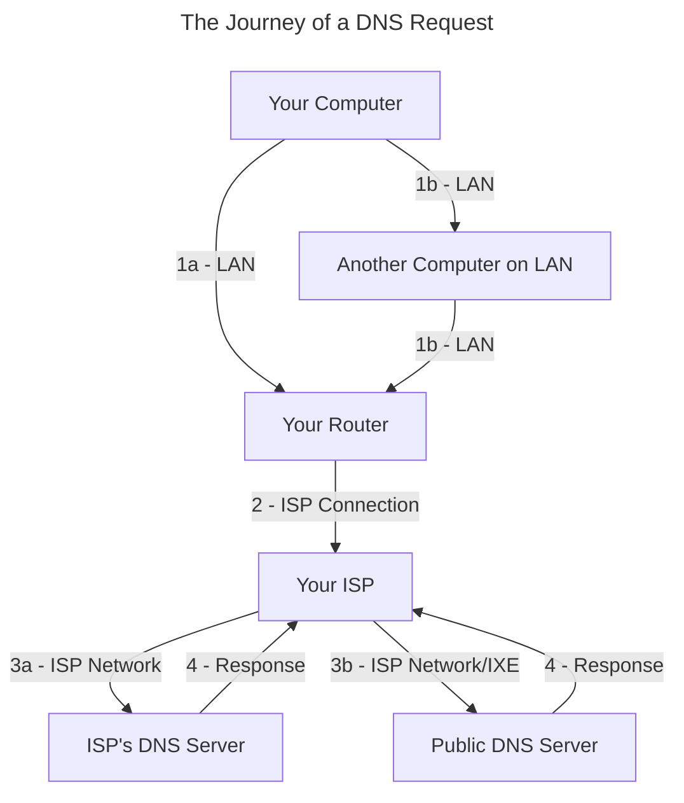
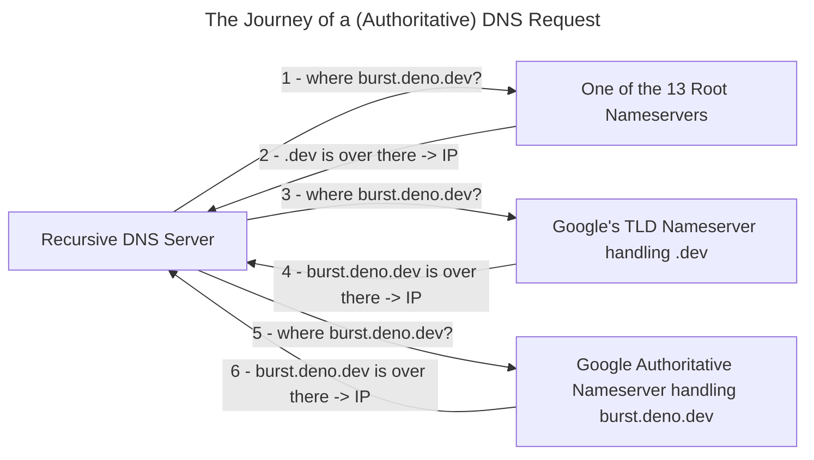

# How Did We End Up Here?

### How Did I End Up Here
&nbsp;&nbsp;&nbsp;&nbsp;&nbsp;&nbsp;&nbsp;&nbsp;Well this page is just [a markdown file](/blog/Build_Your_Own_Website#dynamic-routing) on a computer controlled by [Deno Deploy](https://deno.com/deploy). I uploaded this file to Github and Deno Deploy [grabbed it and uploaded it](https://github.com/ali-layken/BurstUI/actions) to that computer.

### How Did You End Up at This File :page_facing_up: ?
&nbsp;&nbsp;&nbsp;&nbsp;&nbsp;&nbsp;&nbsp;&nbsp;When you clicked the link to visit this post, your request traveled through **several** systems, just like my uploaded file, before reaching the Deno's computer. The file you loaded was sent as [`Network packets`], which is what we call sections of data we send over the internet. These `packets` are usually structured according to a protocols and these protocols serve different purposes. This website's `packets` follow [`HTTPS`] and specifically form an [`HTTPS` Response] which means the message they make when put together and given to your browser display is a website. Deno's computer is listening for `packets` that look like [`HTTPS` Requests] and responding to them, and we call computers that do this web servers.

### Where is Here?
&nbsp;&nbsp;&nbsp;&nbsp;&nbsp;&nbsp;&nbsp;&nbsp;Computers need to be physically connected in some way in order to communicate. This physical connection is sometimes wireless but nonetheless required to transmit and receive data. When many computers are all physically connected typically one of them is assigned to handle receiving and sending all messages to the right person like a post office. This computer is called the router and just like the post office it assigns addresses called `IP Addresses` to each computer so that `packets` with their destination address can be delivered to them. Once a computer is physically connected to a network it can get an `IP Address` by sending out `packets` that make up a [`DHCP` request]. The router hears the request and responds with the address that others can use to send packets to the newly connected computer.

<br/>

How were you able to send `packets` to `burst.deno.dev`, a [hostname] without knowing its `IP`? Just like the protocols for getting website content from web servers, and `IP`s from routers, some computers called [`DNS` Servers] are listening for `hostnames` in the form of [`DNS` requests] so they can respond with the corresponding `IP address`. Every computer's internet settings has an area where you can see what DNS Servers are being used:


My iPad sends all DNS requests to `75.75.75.75` and 3 other addresses of Xfinity computers because when my iPad got its `IP` from my Xfinity router it set these 4 addresses as part of its `DHCP Response`. After the computer at `75.75.75.75` translates `burst.deno.dev` ->  `34.120.54.55` (.eg) my iPad can set create `HTTPS Request` `packets` and set that ip ad the Destination `IP` to ask `burst.deno.dev` for website content.

<br/>

But how did `75.75.75.75` get `burst.deno.dev` `IP`? Well, all `IP`s that make up the internet are allocated by organizations called Regional Internet Registries (RIRs) and leased to ISPs (like Xfinity), hosting providers (like Google), or companies (like Deno Deploy). When your router assigns `IP`s, it does so from ranges that were built to avoid conflicting with all the other computers on "the internet". Deno has also registered `deno.dev` with Google since they manage all `.dev`s. To get `burst.deno.dev`'s `IP` `75.75.75.75` reached out to one of the 13 root `DNS` Servers whose IPs are well known just like `75.75.75.75`. Connecting to these 13 servers will guarantee a [`DNS` Response] if that `hostname` really exists on the internet. These root servers forward the request to Top Level Domain `DNS` Servers, in our case one of Google's computers that is responding to all requests for `.dev` `hostnames`. When Deno registered with Google, they told them to send all `deno.dev` requests to another DNS Server called an Authoritative Name Server, in this case also owned by Google which severs the **final** and **most accurate** record of `burst.deno.dev`'s `IP`. This Domain Name System is sometimes referred to as the *Phonebook of the Internet*.


<br/>

Now that we have `burst.deno.dev`'s `IP` from either a public DNS Server like `75.75.75.75` with cached records or the authoritative server, we can set it as the destination when crafting packets. One of the largest services ISPs provide other than `IP Addresses` is [BGP](https://en.wikipedia.org/wiki/Border_Gateway_Protocol), which is the method by which large networks work together to deliver `packets` to the right `IPs` even if the destination is on the other side of the world.


## Getting Here Safely

A large aspect of security is knowing your enemy and what they are capable of but also knowing the same about yourself. This post is so long because there are many enemies on the internet that are all interested in stealing different **valuables** depending on what you have, and I wanted this post to still work for people that have different internet access issues than my own.

1. Some enemies are simple and just want to steal **bank accounts** by stealing from people who have [bank logins]. This could be done by anyone by **reading** insecure `packets`.
2. Some enemies are craftier and want to [mine crypto currency] by stealing from people with good **GPUs**. This could be done by anyone by **editing** insecure `packets`.
3. The worst enemies want to steal your **education** and by blocking people from [accessing the internet]. This could be done by anyone **routing** insecure `packets` by filtering them.

Not all VPNs function the same, so before we can even get started building anything, I want to just scratch the surface of real potential attacks. Lets see how many vulnerabilities our connection to `burst.deno.dev` has opened us up to. Network security is tricky because our enemy's malicious computer could be hiding on any network at any step between us and `burst.deno.dev`. Let's start with the DNS Request:

### Vulnerabilities



Let's say if your DNS response is [poisoned] instead of `burst.deno.dev` you are forever doomed to go to a funnier blog [techaro] so our enemy is Xe since they want to steal my **valuable** website visitors. A more malicious hacker could send us anywhere and load code into our browser.

1. This is a physical connection that you are responsible for. A router with no security or old security (WPA2 / WEP) can easily be spoofed using a cheap Wi-fi chip [ESP32] and the [marauder] software. This attack would mean that all our `packets` go to another computer on the network that could edit them as they wish before sending them to the router. A similar attack can be done over wired connections in which another computer on the LAN accepts DHCP requests and pretends to be a router. A common solution to this MITM-type of attack over LAN is to have a program running that watches for suspicious activity on the network that a malicious computer would make and blocks that machine from the network.

2. We pay ISPs for security and reliability. In an old apartment of mine on the third floor of a house there was a coaxial cable managed by Xfinity that was just a long wire nailed to the outside of the house that disappeared into a hole under a window and appeared in my room. This is where the router was connected. One day my internet cut out and while I was on the phone with Xfinity I remembered this wire, so I traced it along the side of the house to find it unscrewed to the wire that disappears into the ground! I hung up & screwed it back in and my internet was working again! Anyways, I was on the phone because this connection is something we pay for in America so it is Xfinity's responsibility to deliver the service it said it would (with many loopholes) when I paid for it. It's not possible to just *become* an ISP since Xfinity made deals with the owners of this property to use one of the limited number of internet lines that were laid under that house during its construction, so Xfinity and other ISPs own a lot of wire that covers a lot of land; its about as hard as becoming a real-estate company!

3. In America, some ISPs, like Xfinity, can inject ads or modify traffic at certain stages. In China, ISPs and all Public DNS Servers comply with the government to block DNS requests to sites banned by the State and log the personal information of any citizens making suspicious requests. Turkey and Iran block access to journalism critical of the government by interfering with DNS requests looking for websites blacklisted by the State. The internet exchange is where ISPs hand off `packets` to each other. Each ISP has its own security and user privacy standards that will affect how our `packet` is treated.

4. Responses will have to go back through all the steps they took to deliver the response back.

### What Can We Do?

Without any configuration my DNS Requests will be sent to `75.75.75.75` in plaintext. Luckily [Taher Elgamal](https://en.wikipedia.org/wiki/Transport_Layer_Security#SSL_1.0,_2.0,_and_3.0) invented SSL which we now know and use as TLS. TLS is the S in HTTPS and its what makes it different from HTTP. If BGP is the first wonder of the computing world enabling globalization, Encryption is the second, enabling secure communication. Content sent over HTTPS is encrypted so that only the webserver it is destined for can read the request. HTTPS covers encrypting requests and responses after we figure out the web server's `IP` meaning our ISP can't read or edit any data between us and the web server however, before then, we still have to secure our DNS Request.

2 ways to protect DNS Request and Response content is to turn your `DNS` request into an `HTTPS` request called [`DoH`] or encrypting your DNS with TLS called [`DoT`]. DoH is useful for situations where DoT requests are being blocked as it makes DNS requests indistinguishable from regular HTTPS traffic. DoH, DoT and HTTPS all fail if the destination IP is blocked since the ISP has to be able to read it to deliver the `packet`. A Large problem in secure routing is that root nameservers do not support encrypted DNS protocols like DoH or DoT. Root Nameservers do use DNSSEC to ensure the integrity and authenticity of their DNS records. There are only a few public DNS Servers that support DoH or DoT. If you are relying on Google or Cloudfare as a DoH or DoT provider, first you are at the whim of that company and their decisions and secondly `packets` destined for them  can be completely blocked by ISPs. For this reason DoH, DoT, and HTTPS are not great solutions for ISP level blocking. I won't cover this in this post but the accepted way to anonymously connect to a computer and have them anonymously send content back is by forgoing the whole DNS system to instead use Tor's `.onion` routing provides anonymity and access to the internet behind heavy firewalls through features like [Pluggable Transports] and [Bridge Relays]. In these scenarios the goal is to connect to securely connect to a computer that has free access to the internet, often called a proxy.

As a final note, `.onion` routing and the rest of this article which also relies on encrypted traffic are completely useless in situations where all encrypted traffic is blocked like probably North Korea. In order to get to the internet in North Korea a South Korean could just throw a wire across the line and have a North Korean catch it and wire it up to all their friends and families houses. The problem is physical and the goal is connecting to a proxy with internet access freedom.

### What Will You Do?

At this point you'll need to pick an enemy against which you will protect. The 2 tools we will working on are:

1. An end-to-end encrypted connection between 2 nodes so that all communication between them is private including any responses, requests, and destinations. This is the VPN, and to make it we will be using a software called tailscale that uses the WireGuard protocol to create encrypted connections between computers.
2. A Recursive Name Server that caches DNS so we only have to rely on ourselves, root nameservers, and our connections to them. This is the DNS Server, and we will use pihole + unbound. Pihole will take care of DNS Caching, filtering, and even hosting some custom DNS Records. Unbound will take care of communicating with root servers and verifying the DNSSEC of the responses.

The graph above only covered getting a DNS Request from a Recursive server. Since we will be running our own DNS Server just like those Public DNS Servers and Xfinity's lets take a deeper look at what a recursive DNS server has to do exactly:



Ultimately, if the IP of the **root nameserver**, **tld server**, **authoritative server**, or end **web server** is blocked you are cooked. You will have to send your request to a proxy computer who can communicate with these computers. For me, I am using the VPN to carry requests I make over 5G and public free Wi-fi to my house securely because the enemy I am protecting against are people on networks outside my house ([`1b`jump](#vulnerabilities)). From there, DNS Requests will go to our own recursive server which visits root nameservers to cache authoritative results. I will have to trust Xfinity to not log, block, or modify my DNS Requests to root nameservers since unencrypted DNS Requests are visible to my ISP. Once I get the DNS record it will be saved and any communication with the website will first be encrypted until it reaches my house and then then unwrapped 1 layer to go through my router using HTTP or HTTPs as it normally would as if I was at home. Although I'll still be relying on Xfinity's network to deliver my plaintext DNS Requests I'll be filtering some connections to ad content servers and tracker websites that collect data as you visit them, also effectively circumventing trusting Xfinity's `75.75.75.75` Server which [pihole recommends](https://docs.pi-hole.net/guides/dns/unbound/).

This combination of a VPN to proxy that has access to the needed resources is a pattern that can be adapted for other scenarios. These scenarios are some examples that grow increasingly worse:
1. If you can't trust your ISP to allow connections to root nameservers use a DoH/DoT, which act like an encrypted proxy to root nameservers. This shifts trust from your ISP to a third-party resolver like Google or Cloudflare, but the ISP can still block access to these proxies by filtering their IPs or traffic patterns.
2. If your ISP blocks DoH/DoT providers, you can use a VPN to tunnel traffic to a computer outside your ISP's network that can access Public DNS Servers.
3. Similarly, If your DNS is coming back fine but access to the web server is blocked then you'll need to VPN to a computer that can access that server.
4. If the WireGuard protocol is blocked (no tailscale) then don't use it to connect to the proxy, just connect using DoH/DoT. For example, the Private DNS option on Android uses DNS-over-TLS (DoT) on port 853 to securely send DNS requests to a specified DNS server. In this case it would be useful to use stunnel to accept DoT requests and forward them to a DNS Server available to the proxy like the pihole + unbound setup. I will try to include some setup for this at bottom of this post. 
5. If traffic to 853 is too suspicious and could be potentially blocked you have to use DoH to make DNS requests look like website requests. This post contains no instructions to accept DoH on port 443. If you need this method: setup [cloudflared] on a proxy that can connect to Cloudflare, or use [coredns] to accept requests on 443 and forward them to pihole + unbound. 
6. If the WireGuard protocol is blocked and the IP of the site is also banned you'll need a third item that also unfortunately wont be covered in this post: an HTTPS Proxy. This setup is a bit difficult, so I recommend setting up 2 separate proxies for DNS and HTTPS respectively, using something like [squid] to proxy https requests. In places where WireGuard and other VPNs are banned you will be flagged for sending all your traffic to the same 1 or 2 IPs so at this point you will need multiple https proxies, or better yet, proxies behind IPs of seemingly normal websites like hiding an HTTPS Proxy in a Minecraft server so it looks like you are just connecting to; a Minecraft server. This would explain the quantity and variability of requests to protect from being blocked by some networks. 

By combining these methods, you can navigate through restrictive firewalls. You have to know what you are fighting in order to make a setup that works. In the end, move to Europe.


Some companies offer [free access to computers](https://github.com/cloudcommunity/Cloud-Free-Tier-Comparison) that might be available depending on where you live that can be used to follow the rest of this guide and proxy to a "safe" network where the servers you need are unblocked and unmonitored. All of us have to trust someone at some point since root nameservers don't support encryption. None of us knows where all of the rest of us are (no one has all the DNS Records) and none of us can get to each other alone, no one has a directly wired connection to `burst.deno.dev`, so you we all have to work with other people to get here. 

# VPN Building

## *Step 1:* Tailscale
First I installed tailscale on my pi: [tailscale](https://tailscale.com/download) and started it using:
```shellsession
 $ tailscale up --accept-dns=false --advertise-exit-node
 ```

Tailscale now starts on boot and tunnel all traffic from anyone on the tailnet, like my phone, that has set the pi as the `exit-node`. Additionally, the pi won't be using the Tailscale DNS since we are hosting out own DNS. In the tailscale admin panel, set the ip of the exit-node as the global DNS.

On my Pixel 6 I downloaded the tailscale app and set some network settings:
1. Private DNS to Automatic or Off (I couldn't find a difference).
2. VPN to 'Always-on VPN' and 'Block connections without VPN'. 
3. In the WiFi connection settings I have Static DHCP with the pi's tailscale ipv4 since it only takes ipv4s.

need images.

## *Step 2:* Containers

&nbsp;&nbsp;&nbsp;&nbsp;&nbsp;&nbsp;&nbsp;&nbsp;I love [containers](https://en.wikipedia.org/wiki/LXC) for their security and diversity and portability. Containers [can get very complex](https://hub.docker.com/r/microsoft/windows) but the basic idea for us today is that they are like mini OS environments that run inside your OS. These environments can easily be customized and brought up & down with a script. Having a separate computing environments helps keep things simple and efficient. I'll be building the VPN on my [Raspberry Pi 4 B](https://www.raspberrypi.com/products/):computer: running [Raspbian](https://www.raspbian.org/) :r_pi: + :debian_logo:

Lets say my pi is using Python `3.12` located at `/usr/bin/python`, I won't have to mess with this binary or path at all if pihole asks for say Python `3.10`. Instead, the alternate Python version will just be installed inside the container and found when pihole tries to run `$ python`. Lets say tomorrow after running pihole I wake up and decide I want to maintain a Mailing List. Well then I would pretty much have to run [mailman2](https://github.com/Koumbit/mailman2) of course, which requires an ancient :moyai: deprecated Python `2.7.9` which would really cause issues with anyone on my pi depending on `$ python`.

Containers typically have less [overhead](https://en.wikipedia.org/wiki/Overhead_(computing)) than [Virtual Machines](https://en.wikipedia.org/wiki/Virtual_machine): because they don't emulate hardware or run a separate kernel (OS + Services). However, poorly optimized containers can sometimes have performance issues that make them less efficient than well-optimized VMs. If used properly however, people have reported being able to run over 50+ containers simultaneously on a Pi 4. The finesse of a container comes from its special ability to choose which dependencies it should get it self and which dependencies to reuse from the host machine. Pihole might need a different Python version but it would reuse my pi's raspbian kernel function to read files. 
<br/>

The [details of how containers work](https://opensource.com/article/18/8/sysadmins-guide-containers) and their optimizations are beyond the scope here, container technology [runs very deep](https://opencontainers.org/about/overview/), so for today I give you permission to imagine them as tiny custom linux envs. Containers make it easy to slowly build and test the custom environment needed by some software, but there is always the option to just [install pihole normally in one command](https://github.com/pi-hole/pi-hole/?tab=readme-ov-file#one-step-automated-install) like any other application on your computer or [phone](https://github.com/DesktopECHO/Pi-hole-for-Android) if you're not [worried about your environment](https://en.wikipedia.org/wiki/Climate_change) (skip to Tailscale Section). You don't need a Raspberry Pi or Raspbian, you can run containers on Windows using the Linux kernel from [WSL](https://learn.microsoft.com/en-us/windows/wsl/install) and on MacOS using a Linux kernel from [Lima](https://lima-vm.io/). At the minimum I recommend having an wired (not wireless) connection to the internet on the computer you decide to host the DNS software. The code blocks below are for Raspbian but I will include links to instructions for other OSes. After installing the required softwares everything should behave the same so later on there won't be any need for alternate instructions. Let's gather all the tools we will need to run containers:
<br/><br/>

1. First we will need podman. [Other OSes](https://podman.io/docs/installation). Raspbian:
```shellsession
$ sudo apt-get -y install podman
```

2. Next, to make working with podman simple, we will be using `podman-compose` to run scripts we will use to configure the containers. [Other OSes & Alternate Methods](https://github.com/containers/podman-compose?tab=readme-ov-file#installation). Raspbian.
```shellsession
$ sudo curl -o /usr/local/bin/podman-compose https://raw.githubusercontent.com/containers/podman-compose/main/podman_compose.py
$ sudo chmod +x /usr/local/bin/podman-compose
```

3. Finally, lets just make sure that everything is working fine. All OSes:
```shellsession
$ podman-compose -v
# Expected Output:
#   podman-compose version xxx
#   podman version xxx
```

<br/>

## *Step 3:* Pi-Hole
&nbsp;&nbsp;&nbsp;&nbsp;&nbsp;&nbsp;&nbsp;&nbsp;Hackers are crafty and its hard to tell where attacks might come from. Instead of losing to infinite attacks and their infinite solutions lets always focus on the biggest threats. Pi-Hole is open-source software, meaning that anyone could analyze its code and potentially discover vulnerabilities to exploit, such as gaining shell access on the computer running the software. Using [rootless containers](https://www.redhat.com/en/blog/rootless-containers-podman) would be beneficial here because a shell exploit would not grant the attacker full root access to the host, only access to the container which has its own very limited user which wouldn't let them do much except change the containers contents. In this case, gaining access to pihole or unbound containers specifically could be dangerous because the content being change would be the DNS configuration files possibly mixing up DNS requests to send us to a malicious computer's IP. In a later section we will cover how to mitigate these risks by limiting who can access Pi-hole to prevent them from trying this.

#### Computer Security
Another way to mitigate the risk of a pihole hack is to simply take a look at [this list of people](https://github.com/pi-hole/pi-hole/graphs/contributors). If you can't trust the 221+ people who wrote pihole you can spend 10 minutes checking [their code](https://github.com/pi-hole/pi-hole) for [crazy hax](https://www.youtube.com/watch?v=zEd4Vw2bmBE). If you're really paranoid show your worth and just rewrite the whole thing using vim in assembly yourself. The same people that could find an exploit in pihole could very well also just submit it as a patch and become a contributor:100: #opensourcegang. Security again, is fundamentally about understanding your adversary: if you don't know your enemy, you won't know what to defend against. If your enemy is Nintendo then do not post any of your teams personal information online because they will find you anywhere in the world. If your enemy is Open AI... [run](https://www.pbs.org/newshour/nation/openai-whistleblower-who-raised-legal-concerns-about-chatgpts-datasets-has-died). Real security however is not about attaccs and haxors its about **trust**. The prevailing modern network security isn't about preventing the enemy attack. It's about not even letting them get the chance by [trusting no one](https://en.wikipedia.org/wiki/Zero_trust_architecture). This is great you can build a whole OS on your own, but after making software everyone arrives at the same next step; how do I share this? 
<br/>

### Building the Containers
I started by combining the compose scripts for [pihole compose](https://hub.docker.com/r/pihole/pihole) and unbound [unbound](https://hub.docker.com/r/klutchell/unbound). Compose scripts are used to describe to podman how you want your containers brought up. Theres a couple of important pieces so lets take a look at our `docker-compose.yml` file:

```yml
# Podman Compose configuration for rootless setup
networks:
  hole_net:
    driver: bridge
    enable_ipv6: true
    ipam:
      config:
        - subnet: "192.168.2.0/24"  # IPv4 subnet
        - subnet: "fd14:d095:b9ef:80f2::/64"  # IPv6 subnet

services:
  unbound:
    container_name: unbound
    image: docker.io/klutchell/unbound:latest
    ports:
      - "1153:53/tcp"  # Map DNS TCP to unprivileged port
      - "1153:53/udp"  # Map DNS UDP to unprivileged port
    volumes:
      - type: bind
        read_only: true
        source: ./unb-conf/
        target: /etc/unbound/custom.conf.d/
    dns:
    networks:
      hole_net:
        ipv4_address: 192.168.2.2
        ipv6_address: "fd14:d095:b9ef:80f2::2"
    restart: always

  pihole:
    container_name: pihole
    image: docker.io/pihole/pihole:latest
    ports:
      - "53:53/tcp"  # Map DNS TCP to unprivileged port
      - "53:53/udp"  # Map DNS UDP to unprivileged port
      - "30080:80/tcp" # Admin interface
    environment:
      TZ: 'America/Detroit'
      WEBPASSWORD: ''  # Set your Pi-hole password
      DNSMASQ_LISTENING: 'all'
      PIHOLE_DNS_: "192.168.2.2#53;fd14:d095:b9ef:80f2::2#53"   # Forward DNS to Unbound
    volumes:
      - './etc-pihole:/etc/pihole'
      - './etc-dnsmasq:/etc/dnsmasq.d'
    networks:
      hole_net:
        ipv4_address: 192.168.2.3
        ipv6_address: "fd14:d095:b9ef:80f2::3"
    dns:
      - 192.168.2.2 # Unbound's IP
      - fd14:d095:b9ef:80f2::2 # Unbound's IPv6 (if applicable) 
    depends_on:
      - unbound
    restart: always

```

We don't need to use unbound's [redis integration](https://github.com/ar51an/unbound-redis) for caching DNS requests because this will be taken care of by pihole's [FTLDNS](https://docs.pi-hole.net/ftldns/dns-cache/) "Faster Than Light DNS" includes a caching feature that will take care of that. Running the [the official Pi-Hole compose scripts](https://hub.docker.com/r/pihole/pihole) causes issues due to podman's [aardvarkdns](https://github.com/containers/aardvark-dns) taking up port 53 on the host. Aardvark is a DNS Server that helps translate container names into their virtual IP addresses. Computers can be associated with multiple IPs and *hostnames* that can be used to find them on different networks. Later each of our computers will receive that IP i mentioned from Tailscale which is it's address on the tailnet. We don't have to deal with this [this aardvark issue](https://github.com/containers/podman/discussions/14242) since we are using rootless containers which bind to 53 just fine.

It is not needed to actually mount an `unbound.conf`, I just included the volume setup if needed. Delete it if you are fine with the container's [default `unbound.conf`](https://github.com/klutchell/unbound-docker/blob/main/rootfs_overlay/etc/unbound/unbound.conf). It has been customized notably to; run smoothly in a container and also use `DNSSEC`. The container maintainer also provides some [example `unbound.conf`s](https://github.com/klutchell/unbound-docker/tree/main/examples) that customize unbound in different ways. To mount one of these `.conf`s into the container create `/unb-conf/unbound.conf` and paste in the conf, and then add this to the `unbound` section of the compose:

```yml
    volumes:
      - type: bind
        read_only: true
        source: ./unb-conf/
        target: /etc/unbound/custom.conf.d/
```

The pihole folders should create themselves but you can create them manually if needed using `mkdir etc-pihole etc-dnsmasq`, but be mindful of the [rwx permissions] since rootless containers don't have many.

### Running & Stopping

Since we aren't using rootful containers podman-compose will have a hard time starting pihole on port 53 which is the special privileged default DNS port. There are many ways to setup linux environments that depend on your enemies. I'll just share what I did to allow podman-compose to run these rootless containers:

```shellsession
$ sudo sysctl -w  net.ipv4.ip_unprivileged_port_start=0

# -- Repeat this section --
$ podman-compose --verbose up -d #Running 
$ podman logs pihole # use logs -f to follow
$ podman logs unbound 
$ podman-compose --verbose down #Stopping
# -- Edit the compose and repeat^ --

# When done - dont run the stop command just:

$ sudo sysctl -w  net.ipv4.ip_unprivileged_port_start=1024
```

### Automating

To automate this process after reboot is a little more tricky but this is the desirable setup for any server, things happen computers crash and shutdown, its best to make sure everything is easy to get back up again. I find no difference between letting pihole use 53 or mapping pihole to 1053 and then forwarding all 53 requests to 1053 so I wont setup port forwarding. This setup does have lower unprivileged ports on boot so a very specifically timed attack could start a user process on a privileged port before I set it back to 1024.  Adding linux capabilities in the compose didn't work so we will have to do this somehow. Adjust this linux system configuration section for your own needs:

<br/>

First we have to set the unprivileged ports to 0 in `/etc/sysctl.d/99-sysctl.conf` so that on boot podman-compose can start pihole:

```ini
net.ipv4.ip_unprivileged_port_start=0 
```

Next we will start our rootless containers on boot. I used [this article](https://www.it-hure.de/2024/02/podman-compose-and-systemd/) to understand podman-compose's relationship with systemd since this command is pretty undocumented. In the folder with the docker-compose run:

```shellsession
$ podman-compose systemd
$ systemctl --user enable --now 'podman-compose@pihole'
```

This creates a systemd user unit file that describes to systemd how we want pihole to start on boot. After a reboot with this service enabled you can see if it started ok and check the logs using:

```shellsession
$ systemctl --user status 'podman-compose@pihole' #Startup status
$ journalctl --user -xeu 'podman-compose@pihole' #Logs
```

The problem is now that our unprivileged ports are set to 0. To fix this I just made another user unit file that runs after podman-compose@pihole at `~/.config/systemd/user/unpriv.service`:

```ini
[Unit]
Description=Set net.ipv4.ip_unprivileged_port_start to 1024
After=podman-compose@pihole.service
Requires=podman-compose@pihole.service

[Service]
Type=oneshot
ExecStart=/usr/bin/sudo /sbin/sysctl -w net.ipv4.ip_unprivileged_port_start=1024
RemainAfterExit=yes

[Install]
WantedBy=default.target
```

Now on boot pihole is listening for DNS requests on port 53. But DNS Request by default go to port 53 so now we need a firewall rule to send all 1053 traffic ot 53

### Configuration

The compose file above also contains a `WEBPASSWORD` and forward pihole's port 80 to the host. Check if pihole started up fine by visiting `10.0.0.2/admin` in a web browser. You should be greeted with an admin portal where you can login using `WEBPASSWORD`. After logging in there are a couple settings we will need to modify:
<br/>

1. Under *Settings* > *DNS* > *Upstream DNS Servers* we will have to tell pihole where to find unbound. The upstream DNS Server should be set by the compose file but in case it isn't make sure you put `unbound_IP#unbound_port`.

2. To support DNS requests over the tailnet we will have to disable the hop-based filtering in *Interface Settings* right under the *Upstream DNS Server* section, but don't worry, we will secure our whole network with a firewall after we get everything up.

3. I found that DNSSEC worked properly when unchecked and improperly when checked probably due to unbound but you are welcome to do your own research. Check the first 2 options under *Advanced DNS Settings* for speed and security unless you have some other sort of setup you are going for.

4. Go to *Adlists* and paste URLs of ad block lists. [Here are some examples](https://github.com/hagezi/dns-blocklists). 

If everything is working you'll want to edit `/etc/resolv.conf` on your proxy:

```ini
nameserver 127.0.0.1
```

so that all local DNS Requests go through pihole. This completes the loop so that requests over the tailnet are fed into pihole + unbound :) 

# Whats next

This article won't particularly help with the TikTok ban. The U.S. government won't mess with DNS directly because that would be blatantly oppressive and cause backlash from a larger computing community that isn't impacted by the removal of TikTok. Instead they'll ask Apple and Google, the organizations with actual power, to take the app off the app store, and our apps will stop working after updates are released. Yes, there are alternative app stores on iOS and [Android](https://f-droid.org/en/), but most normal people won't bother. The power comes not in actions like DNS manipulation, or App Removals but rather but in the human reliance on monopolistically controlled of centralized platforms. Theres no other way to put it, companies already ran the world, but now its specifically the companies that own the resources needed in the modern world, we already live in a Global Technocracy.

The true path forward is about rethinking the entire infrastructure of the internet. Decentralized systems like the [Etherum Name Service](https://ens.domains/) offer a future where reliance on centralized entities like root nameservers, Apple, Google, and their cozy government partnerships is no longer a given. Instead of trusting organizations that can dictate access to apps and services, we could store DNS records on blockchains governed by decentralized protocols, making them immutable, censorship-resistant, and globally accessible.

But ENS alone isn't the endgame. It's one piece of a broader puzzle. The real revolution lies in building encrypted peer-to-peer (P2P) networks and applications that bypass traditional DNS entirely. Think `.onion` routing, but at scale and accessible to everyone—not just privacy enthusiasts or dissidents. The U.S. government originally released `.onion` routing technology to obscure military traffic by mixing it with civilian use. Why can't we take that same principle and flood ISP networks with encrypted, decentralized traffic to create a world where tracking, blocking, or censoring becomes the exception, not the rule?

Let's not kid ourselves, though. As I write this, I'm still relying on Deno Deploy and its ISP to serve this article—for free. That's the bittersweet truth of decentralization today: it's expensive because its new so it's hard to prove its a good investment. The infrastructural and economic incentives for truly decentralized systems are starting to take shape like the [FDA's DSCSA](https://www.fda.gov/drugs/drug-supply-chain-integrity/drug-supply-chain-security-act-dscsa). And while ENS offers a decentralized alternative, it costs money which is not the enemy, it costs money to make good systems. ENS is just an example, the real beauty of decentralization is: it's permissiveness. If you don't like how ENS or `$ENS` holders govern their system, you can fork it. Build your own decentralized DNS on any blockchain or decentralized network. Experiment. Fail. Try again. The goal isn't perfection, it's progress.

This isn't just about TikTok, DNS, or even censorship. It's about reshaping the fabric of the internet. A world where you control your data, your domains, and your applications, without needing the approval of corporations or governments. So let's encrypt everything, decentralize everything, and even encrypt traffic for no reason stuff that doesn't need to be. Because every byte of encrypted traffic helps shift the balance of power toward the people. The reign of centralization doesn't end overnight—but every encrypted `packet` step we take toward a decentralized future brings us closer to a web that belongs to everyone, not just a privileged few with enough money.