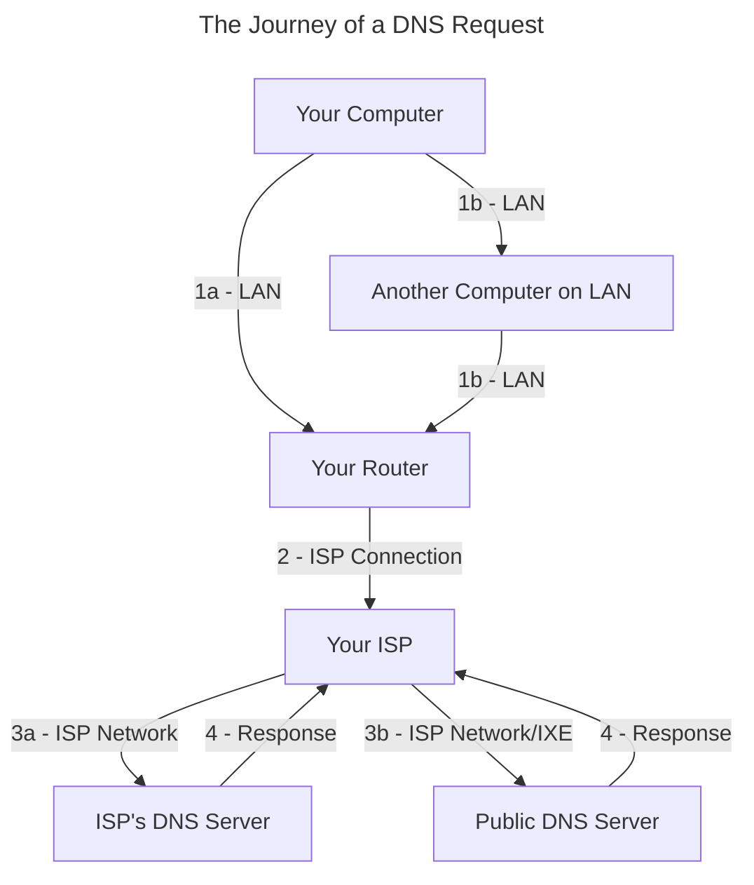
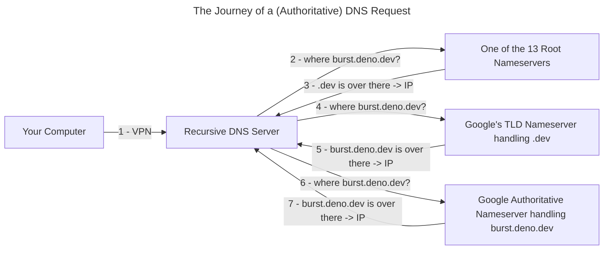

# How Did We End Up Here?

### Sending Files Over the Internet :page_facing_up:
&nbsp;&nbsp;&nbsp;&nbsp;&nbsp;&nbsp;&nbsp;&nbsp;This page is [a markdown file](/blog/Build_Your_Own_Website#dynamic-routing) :page_facing_up: on a computer controlled by [Deno Deploy](https://deno.com/deploy) :deno_logo:. I uploaded this file to Github :github_logo: and Deno Deploy [grabbed it and uploaded it](https://github.com/ali-layken/BurstUI/actions) to that computer. When you clicked the link to visit this post, your request traveled through **several** systems, just like my uploaded file, before reaching the Deno's computer :computer:. The file you loaded was sent as [Network packets](https://en.wikipedia.org/wiki/Network_packet), which is what we call sections of data we send over the internet. These packets are usually structured according to a protocols and these protocols serve different purposes. This website's packets follow [HTTPS](https://en.wikipedia.org/wiki/HTTPS) and specifically form an *HTTPS Response* which means the message they make when put together and given to your browser display is a website. Deno's computer is listening for packets that look like *HTTPS Requests* and responding to them. We call computers that do this [Web Servers](https://en.wikipedia.org/wiki/Web_server) :computer:.

<br/>

### Where is Here? :earth_africa:
&nbsp;&nbsp;&nbsp;&nbsp;&nbsp;&nbsp;&nbsp;&nbsp;Computers :computer: need to be physically connected in some way in order to communicate. This physical connection is sometimes [wireless](https://en.wikipedia.org/wiki/Wireless_network) 🛜, but nonetheless **required** to transmit and receive data over [the internet](https://en.wikipedia.org/wiki/Internet_Protocol). When multiple computers are physically connected, typically one of them is assigned to handle receiving and sending out messages to the right person like a post office. This computer is called the [Router](https://en.wikipedia.org/wiki/Router_(computing)) :computer: and [just like the post office](https://en.wikipedia.org/wiki/House_numbering) it assigns addresses called [IP Addresses](https://en.wikipedia.org/wiki/IP_address) to each computer so that packets destined for them can be delivered :mailbox_with_mail:. Once a computer is physically connected to a network it can get an *IP Address* by sending out *packets* that constitute up a [*DHCP*](https://learn.microsoft.com/en-us/windows-server/networking/technologies/dhcp/dhcp-top) *Request*. The router hears the request and responds with an address that other connected computers :desktop_computer: can use to send packets :incoming_envelope: to the newly connected computer :computer:. *Request* packets sent over the internet typically **require** [destination and return addresses](https://en.wikipedia.org/wiki/Network_packet#Contents).

<br/>

`burst.deno.dev` is a [hostname](https://en.wikipedia.org/wiki/Hostname); a human readable & memorable label we give to computers. Hostnames *are not* IPs, which we know are **required** for internet connections... So how were you able to send packets to Deno's Computer :computer: without knowing its IP? Just like the protocols for receiving website content from *web servers*, and getting IPs assigned by *routers*, some computers called *[*DNS*](https://en.wikipedia.org/wiki/Domain_Name_System) Servers* listen for hostnames in the form of *DNS Requests* so they can respond with the corresponding computer's IP address. Every computer's internet settings :gear: has an area where you can see which *DNS Servers* are being used to "resolve" hostnames:


My iPad :apple_logo: sets all *DNS Request packets* to be destined for `75.75.75.75` and 3 other addresses of Xfinity computers because when my iPad got its IP from my Xfinity router :computer: it additionally set these 4 addresses as [part of its *DHCP Response*](https://en.wikipedia.org/wiki/Dynamic_Host_Configuration_Protocol#Options). After the computer at `75.75.75.75` translates ("resolves") `burst.deno.dev` ->  `34.120.54.55 (.eg)` my iPad can craft *HTTPS Request packets* with that IP set as the destination IP. Handing these request packets to my router will properly retrieve website content from the IP resolved by DNS. I'll explain more about how this happens after addressing a glaring question...

#### The Domain Name System :globe_with_meridians:

&nbsp;&nbsp;&nbsp;&nbsp;&nbsp;&nbsp;&nbsp;&nbsp;How did `75.75.75.75` get `burst.deno.dev`'s IP in the first place? 

<br/>

All IPs that make up *the internet* are allocated by organizations called [Regional Internet Registries](https://en.wikipedia.org/wiki/Regional_Internet_registry), and are then leased to:
1. [Internet Service Providers](https://en.wikipedia.org/wiki/Internet_service_provider) like :xfinity_logo: Xfinity
1. [Hosting providers](https://en.wikipedia.org/wiki/Web_hosting_service) like :google_logo: Google
1.  Or other companies like :deno_logo: Deno Deploy

When your router assigns IPs, it does so from [specific IP ranges](https://en.wikipedia.org/wiki/Private_network) that were built to avoid conflicting with all the other computers on *the internet*. Along with getting an IP, Deno has also registered `deno.dev` with Google since they manage keeping track of [all `.dev`s](https://en.wikipedia.org/wiki/.dev). 

<br/>

To get `burst.deno.dev`'s IP Xfinity reached out to one of the [13 Root DNS Servers](https://en.wikipedia.org/wiki/Root_name_server) whose IPs are well known just like `75.75.75.75`. Connecting to any 1 of these 13 servers will guarantee a *DNS Response* if that hostname really exists on the internet. These Root Servers send us to [Top Level Domain](https://en.wikipedia.org/wiki/Top-level_domain) *DNS Servers*, in our case one of Google's computers that is responding to all requests for `.dev` hostnames. When Deno registered with Google, they told them to send all `deno.dev` requests to another *DNS Server* called an [Authoritative Name Server](https://en.wikipedia.org/wiki/Name_server#Authoritative_name_server), in this case also owned by Google, which is defined by its role; serving the **final** and **most accurate** record of `burst.deno.dev`'s IP. All other records, cached or otherwise, are considered non-authoritative. This Domain Name System is sometimes referred to as the **_Phonebook of the Internet_**.


<br/>

`burst.deno.dev`'s IP can come from many places, as we will explore in [the final sectionjump](/) on alternatives to this traditional [Web2](https://en.wikipedia.org/wiki/Web_2.0) *Root Nameserver*-based *DNS*. For now let's continue exploring [Recursive Name Servers](https://en.wikipedia.org/wiki/Name_server#Recursive_Resolver) like `75.75.75.75` and other [Public DNS Servers](https://en.wikipedia.org/wiki/Public_recursive_name_server) that cache and server authoritative records.

<br/>

One of the largest services ISPs provide other than selling IP Addresses is [BGP](https://en.wikipedia.org/wiki/Border_Gateway_Protocol), which is the method by which large networks work together to deliver packets to the right IPs even if the destination is on the other side of the world. The internet wouldn't be the same without *BGP* + *DNS* so I consider their combination, [routing](https://en.wikipedia.org/wiki/Routing), the **first wonder of the internet**; allowing *globalization*.


## Getting Here Safely

&nbsp;&nbsp;&nbsp;&nbsp;&nbsp;&nbsp;&nbsp;&nbsp;A large aspect of security is knowing your enemy :bust_in_silhouette: and what they are capable of but also knowing the same about yourself :bust_in_silhouette:. This post is so long because there are too many enemies on the internet that are all interested in stealing different **valuables** :gem: depending on what you have. I wanted this post to still work for people that have different internet access issues than my own. You'll need to start thinking about what is valuable to *you* and consider who *your* enemies could be:

1. Some enemies are simple and just want to steal **bank accounts** :bank: by stealing from people who have [bank logins](https://malpedia.caad.fkie.fraunhofer.de/details/apk.joker). This could be done by anyone by *reading insecure packets*.
2. Some enemies are craftier and want to [mine crypto currency](https://github.com/cazala/coin-hive) :pick: by stealing from people with good **GPUs**. This could be done by anyone by *editing insecure packets*.
3. The worst enemies want to steal your **education** and by blocking people from [accessing the internet](https://en.wikipedia.org/wiki/Internet_censorship#Approaches). This could be done by anyone *routing insecure packets* by filtering them.

<br/>

Not all VPNs function the same, so before we can even get started building anything, I want to just scratch the surface of *realistic* threats & *potential* attacks. Lets see how many vulnerabilities our connection has opened us up to. Network security is tricky because our enemy's malicious computer could be hiding on any network at any step between us and `burst.deno.dev`. Let's examine our *DNS Request*:

### Vulnerabilities



<br/>

Let's say if your *DNS response* is [poisoned](https://en.wikipedia.org/wiki/DNS_spoofing) instead of `burst.deno.dev` the IP returned sends you to a funnier blog [techaro](https://xeiaso.net/blog/series/techaro/). Our enemy is Xe since they want to steal my **valuable** website visitors. A more malicious hacker could send us **anywhere** and load code into our browser.

1. **LAN** *-* This is a physical connection that you are responsible for:
    * A router with no wireless security or old security (WPA2 / WEP) can easily be spoofed using a cheap Wi-fi chip [ESP32](https://en.wikipedia.org/wiki/ESP32) combined with the [marauder](https://github.com/justcallmekoko/ESP32Marauder) software. This attack would mean that *all* our packets would be sent to another computer on the network that could edit them as they wish before sending them to the router.
    * A similar attack can be done over wired connections in which another computer on the LAN accepts *DHCP Requests* and pretends to be a router. A common solution to this MITM-type of attack over LAN is to have a program running that watches for suspicious activity on the network that a malicious computer would make and blocks that machine from the network.

2. **ISP Connection** *-* We pay ISPs for security and reliability. In an old apartment of mine on the third floor of a house there was a coaxial cable managed by Xfinity that was just a long wire nailed to the outside of the house that disappeared into a hole under a window and appeared in my room. This is where the router was connected. One day my internet cut out and while I was on the phone with Xfinity I remembered this wire, so I traced it along the side of the house to find it unscrewed to the wire that disappears into the ground! I hung up & screwed it back in and my internet was working again! Anyways, I was on the phone because this connection is something we pay for in America so it is Xfinity's responsibility to deliver the service they said they would (with many loopholes) when I paid for it. It's not easy to become an ISP since Xfinity made deals with the owners of this property to use one of the limited number of internet lines that were laid under that house during its construction. Xfinity and other ISPs own a lot of wire that covers a lot of land; its about as expensive as starting a real-estate company!

3. **ISP Network / IXE** *-* 
   * In America, ISPs, like Xfinity, can legally inject ads into responses. ISPs can also [throttle](https://en.wikipedia.org/wiki/Bandwidth_throttling) some connections which can be abused to block content.
   * In China, ISPs and all *Public DNS Servers* must [comply with the government to block DNS](https://en.wikipedia.org/wiki/Great_Firewall) requests to sites banned by the State and log the personal information of any citizens making suspicious requests.
   * [Turkey](https://en.wikipedia.org/wiki/Censorship_in_Turkey#Internet_censorship) and [Iran](https://en.wikipedia.org/wiki/Internet_censorship_in_Iran#Methods) block access to journalism critical of the government by interfering with *DNS Requests* looking for websites blacklisted by the State. The internet exchange is where ISPs hand off packets to each other. Each ISP has its own security and user privacy standards that will affect how our packet is treated.

4. **Response** *-* Responses will have to go back through all the steps they took to deliver the response back.

### What Can We Do?

&nbsp;&nbsp;&nbsp;&nbsp;&nbsp;&nbsp;&nbsp;&nbsp;Without any configuration my DNS Requests will be sent to `75.75.75.75` in plaintext, meaning the data is completely readable and editable. Luckily [Taher Elgamal](https://en.wikipedia.org/wiki/Transport_Layer_Security#SSL_1.0,_2.0,_and_3.0) invented [SSL](https://en.wikipedia.org/wiki/Transport_Layer_Security) which we now know and use as TLS. TLS is the S in HTTPS and its what makes it secure in contrast with HTTP. Encryption is the **second wonder of the internet**, enabling secure communication; by importing the ability to *trust each other* to the internet. Content sent over HTTPS is encrypted so that only the web server it is destined for can read the request. HTTPS covers encrypting *requests* and *responses* after we figure out the web server's IP; meaning our ISP can't read or edit data between us :computer: and the web server :computer: with some exceptions. However, before then, we still have to secure our DNS Request...

<br/>

The 2 ways to protect *DNS Request* and *Response* content is to turn your *DNS Request* into an HTTPS request called [`DoH`](https://developers.cloudflare.com/1.1.1.1/encryption/dns-over-https/encrypted-dns-browsers/) or encrypting your DNS with TLS called [`DoT`](https://www.cloudflare.com/learning/dns/dns-over-tls/). DoH is useful for situations where DoT requests are being blocked as it makes DNS requests indistinguishable from regular HTTPS traffic. DoH, DoT and HTTPS all fail if the [destination IP is blocked](https://en.wikipedia.org/wiki/Deep_packet_inspection) since the ISPs have to be able to read the destination too in order to deliver the `packet`.

<br/>

A **large** problem in *secure routing* is that root nameservers do not support encrypted DNS protocols like DoH or DoT meaning the DNS system forces plaintext communication. Most Nameservers only offer [DNSSEC](https://en.wikipedia.org/wiki/Domain_Name_System_Security_Extensions) to ensure the integrity and authenticity of the *DNS Records* they serve, but nothing to secure data over the connection leaving DNS extremely vulnerable to censorship. There are only a few *Public DNS Servers* that support DoH or DoT. Using these relies on Google or Cloudfare to be a secure provider, while also creating an easily blockable bottleneck, dooming access to DoH and DoT to blocked easily blocked in some places. I won't cover this in this post but the currently accepted way to anonymously connect to a computer and have them anonymously send content back is by forgoing the whole DNS system to instead use Tor's `.onion` routing. `.onion` routing provides anonymity and access to the internet behind heavy firewalls through features like [Pluggable Transports](https://tb-manual.torproject.org/circumvention/) and [Bridge Relays](https://support.torproject.org/censorship/censorship-7/). 

<br/>

When sticking with DNS in these scenarios with high internet censorship, [the goal](https://en.wikipedia.org/wiki/Deep_packet_inspection#Encryption_and_tunneling_subverting_DPI) is to securely connect to a computer that has *free access to the internet*, often called a [proxy](https://en.wikipedia.org/wiki/Proxy_server) :computer:. I will offer some examples of how to modify the proxy we make to fit your needs. This encrypted proxy is the beating heart :heartbeat: that constitutes the VPNs like the one we will be building. The rest of this article relies on encrypted traffic and is completely  useless in situations where all encrypted traffic is blocked like probably North Korea. Realistically, the easiest way to get internet in North Korea would be if a South Korean could just throw a wire across the line and have a North Korean catch it and wire it up to all their friends and families houses. Routing is a *physical* problem and both of our goals will be to connect to a proxy with the level of internet security and freedom that we each need. In the final section we will cover how the future of routing can change for the better.

### What Will You Do?

&nbsp;&nbsp;&nbsp;&nbsp;&nbsp;&nbsp;&nbsp;&nbsp;To move on, by now, you *must* have some enemies in mind so you can follow the building sections with a *defense system* in mind. The 2 building blocks of our customized VPN are:

1. An end-to-end encrypted connection between 2 nodes :computer: so that all communication between them is private including any requests, responses, and destinations. This is the **VPN**, and to make it we will be using a software called *tailscale* that uses the WireGuard protocol to create encrypted connections between computers.
2. A **Recursive Name Server** that caches DNS so we only have to rely on ourselves, root nameservers, and our connections to them. This is the DNS Server, and we will use pihole + unbound. *Pihole* will take care of DNS Caching, filtering, and even hosting some custom DNS Records. *Unbound* will take care of communicating with root servers and verifying the DNSSEC of the responses.

The *The Journey of a DNS Request* only covered getting a *DNS Request* from a *Recursive Server*. Since we will be running our own *Recursive Server* just like those *Public DNS Servers* and Xfinity's, lets take a deeper look at what a *Recursive Server* is responsible for exactly:


<br/>

Ultimately, if the IP of the *Root Nameserver*, *TLD server*, *Authoritative Server*, or end *Web Server* is blocked you are cooked. You will have to send your request to a proxy computer who can communicate with these computers. For me, I am using the VPN to carry requests I make over 5G and public free Wi-fi to my house securely because the enemy I am protecting against are people on networks outside my house ([`1b`jump](#vulnerabilities)). DNS Requests will go to our own recursive server which visits root nameservers to cache authoritative results. This setup trusts Xfinity to not log, block, or modify my plaintext *DNS Requests* over trusting random public networks and their security measures.

<br/>

*DNS Records*, *HTTP/S Communication*, and any other internet activity will be completely encrypted until it reaches the proxy at my house and then then unencrypted by one layer so my request can go through my router normally as if I was at home. Although I'll still be relying on Xfinity's network to deliver my plaintext *DNS Requests* to *Root Nameservers* I'll be filtering connections to ad content servers and tracker websites that collect data as you visit them, effectively circumventing any reliance on Xfinity's `75.75.75.75` server which [pihole recommends](https://docs.pi-hole.net/guides/dns/unbound/). This setup is a VPN-to-Recursive-Server but let's see how we can arrange this for your enemies.

<br/>

This combination of a VPN to proxy that has trustable access to the needed resources is a pattern that can be adapted for other scenarios. These scenarios are some examples that grow increasingly worse in what is blocked:
1. **Root Nameserver**: If you can't trust your ISP to allow connections to Root Nameservers, use a *Public DoH/DoT*, which act like an encrypted proxy to Root nameservers. This shifts trust from your ISP to a third-party resolver like Google or Cloudflare, but the ISP can still block access to these proxies by filtering their IPs or traffic patterns. (DoH)
2. **DoH/DoT**: If your ISP blocks DoH/DoT providers, you can use a *VPN* to tunnel traffic to a computer outside your ISP's network that can access *Public DNS Servers*. (VPN-to-DNS)
3. **Specific IPs**, If your DNS is coming back fine but access to the web server is blocked then you'll need to *VPN* to a computer that can *access that server*. (VPN)
4. **VPNs**: Don't use it to connect to the proxy, just connect using *DoH/DoT*. For example, the Private DNS option on Android uses DNS-over-TLS (DoT) on port 853 to securely send DNS requests to a specified DNS server. In this case it would be useful to use [stunnel](https://www.stunnel.org/) to accept *DoT* requests and forward them to a DNS Server available to the proxy like the *pihole + unbound* setup. I will try to include some setup for this at bottom of this post. (DoH / DoT)
5. **Encrypted Traffic**: If traffic to 853 is too *suspicious* and could be potentially blocked you have to use *DoH* to make DNS requests *look* like website requests. This post contains no instructions to accept DoH on port 443. If you need this method: setup [cloudflared](https://github.com/cloudflare/cloudflared) on a proxy that can connect to Cloudflare, or use [coredns](https://coredns.io/) to accept requests on 443 and forward them to pihole + unbound. (DoH / DoH-to-DNS)
6. **VPNs & Encrypted Traffic**: You'll need a third item that also unfortunately wont be covered in this post: an *HTTPS Proxy*. This setup is a bit difficult, so I recommend setting up 2 separate proxies for DNS and HTTPS respectively, using something like [squid](https://www.squid-cache.org/) to proxy https requests. In places where encrypted traffic is banned you will be flagged for sending all your traffic to the same 1 or 2 IPs so at this point you will need *multiple https proxies* and *multiple dns proxies*, or better yet, *proxies behind IPs* of seemingly normal websites like hiding an *HTTPS Proxy* in a Minecraft server so it looks like you are just connecting to; a Minecraft server. Creative solutions protect being blocked on networks with tough policies by obfuscate the quantity and variability of requests. (DoH + HTTPS Proxy)

<br/>

Some companies offer [free access to computers](https://github.com/cloudcommunity/Cloud-Free-Tier-Comparison) :desktop_computer: that might be available depending on where you live that can be used to follow the rest of this guide and proxy to a "safe" network where the servers you need are unblocked and unmonitored. All of us have to trust someone at some point since *Root Nameservers* don't support encryption. None of us knows where all of the rest of us are (no one has all the DNS Records) and none of us can get to each other alone, no one has a directly wired connection to `burst.deno.dev`, so you we all have to work with other people to get here.

<br/>

By combining these methods, you can create systems to navigate through restrictive firewalls. You have to know what you are fighting :fist_oncoming: in order to make a setup that works. If nothing works, I am sorry, and I hope the final section of this post gives you some hope for a censorship-resilient future :rainbow::sunrise_over_mountains: where redundant proxies are ample.

# VPN Building

## *Step 1:* Tailscale VPN
&nbsp;&nbsp;&nbsp;&nbsp;&nbsp;&nbsp;&nbsp;&nbsp;First I installed :tailscale_logo: [tailscale](https://tailscale.com/download) on my :r_pi: [Raspberry Pi 4 B](https://www.raspberrypi.com/products/) :computer: and started it using:
```shellsession
 $ tailscale up --accept-dns=false --advertise-exit-node
 ```

On my Pixel 6 :google_logo: I downloaded the tailscale app and set some network settings:
1. Private DNS to *Automatic* or *Off* (I couldn't find a difference).
2. VPN to *Always-on VPN* and *Block connections without VPN*. 
3. In the WiFi connection settings I have *Static DHCP* with the pi's tailscale [ipv4](https://en.wikipedia.org/wiki/IPv4) address since it only takes ipv4s.
4. In the tailscale app, I set my pi as the `exit-node`

Tailscale now starts when my pi boots and tunnels all traffic from any other device that has it set as the `exit-node`. This means that all the internet traffic on my phone first is encrypted and sent to my pi, after which, it is handed to my router normally. The pi won't be using the *Tailscale DNS* since we are hosting out own *DNS Server*. Now we have but an effective encrypted proxy. You can tap-out at this point if you trust your ISP's *DNS Servers*. If you are continuing, in the tailscale admin panel, set the IP of the `exit-node` as a `Global Nameserver`. 

## *Step 2:* Containers

&nbsp;&nbsp;&nbsp;&nbsp;&nbsp;&nbsp;&nbsp;&nbsp;I love [containers](https://en.wikipedia.org/wiki/LXC) for their security, diversity, and portability. Containers [can get very complex](https://hub.docker.com/r/microsoft/windows) but the basic idea for us today is that they are like mini OS environments that run inside your OS. These environments can easily be customized and brought up & down with a script. Having a separate computing environments helps keep things simple and efficient.

<br/>

Lets say my pi is using :python_logo:Python `3.12`  located at `/usr/bin/python`, I won't have to mess with this binary or path at all if pihole asks for say Python `3.10`. Instead, the alternate Python version will just be installed inside the container and found when pihole tries to run `$ python`. Lets say tomorrow, after running pihole, I wake up and decide I want to maintain a [Mailing List](https://meta.wikimedia.org/wiki/Mailing_lists/Overview). Well then I would pretty much have to run [mailman2](https://github.com/Koumbit/mailman2) of course, which requires an ancient :moyai: deprecated Python `2.7.9` which would really cause issues with anyone on my pi depending on `$ python`.

<br/>

Containers typically have less [overhead](https://en.wikipedia.org/wiki/Overhead_(computing)) than [Virtual Machines](https://en.wikipedia.org/wiki/Virtual_machine): because they don't emulate hardware or run a separate [kernel](https://en.wikipedia.org/wiki/Kernel_(operating_system)) (OS + Services). However, poorly optimized containers can sometimes have performance issues that make them less efficient than well-optimized VMs. If used properly however, people have reported being able to run over 50+ containers simultaneously on a Pi 4. The *finesse* of a container comes from its special ability to choose which dependencies it should get it self and which dependencies to reuse from the host machine. Pihole might need a different Python version but it would reuse my pi's :debian_logo: Raspbian kernel functions, for example, to read files. 

<br/>

The [details of how containers work](https://opensource.com/article/18/8/sysadmins-guide-containers) and their optimizations are beyond the scope here, container technology [runs very deep](https://opencontainers.org/about/overview/), so for today I give you permission to imagine them as tiny custom linux envs. Containers make it easy to slowly build up and test the custom environment needed by some software, but there is always the option to just install pihole normally in one command like any other application on your [computer](https://github.com/pi-hole/pi-hole/?tab=readme-ov-file#one-step-automated-install) or [phone](https://github.com/DesktopECHO/Pi-hole-for-Android) if you're not [worried about your environment](https://en.wikipedia.org/wiki/Climate_change). It would be a really funny alternate setup to instead install pihole + tailscale on an :android_logo: Android and leave it on some network to act as a `exit-node` proxy :computer:.

<br/>

You can run containers on Windows :ms_logo: using a Linux kernel from [WSL](https://learn.microsoft.com/en-us/windows/wsl/install), and on macOS :apple_logo: using a Linux kernel from [Lima](https://lima-vm.io/). At the minimum I recommend having an wired (not wireless) connection to the internet on the proxy :computer: you decide to host the DNS software. The code blocks below are work best with [ARM](https://en.wikipedia.org/wiki/ARM_architecture_family) :computer:s but I will include links and instructions for other OSes. Let's gather all the tools we will need to run containers:

<br/>

1. First we will need podman. [Other OSes](https://podman.io/docs/installation). Raspbian:
```shellsession
$ sudo apt-get -y install podman
```

2. Next, to make working with podman simple, we will be using `podman-compose` to run scripts we will use to configure the containers. [Other OSes & Alternate Methods](https://github.com/containers/podman-compose?tab=readme-ov-file#installation). Raspbian.
```shellsession
$ sudo curl -o /usr/local/bin/podman-compose https://raw.githubusercontent.com/containers/podman-compose/main/podman_compose.py
$ sudo chmod +x /usr/local/bin/podman-compose
```

3. Finally, lets just make sure that everything is working fine. All OSes:
```shellsession
$ podman-compose -v
# Expected Output:
#   podman-compose version xxx
#   podman version xxx
```

## *Step 3:* Pi-Hole
&nbsp;&nbsp;&nbsp;&nbsp;&nbsp;&nbsp;&nbsp;&nbsp;Hackers are crafty and its hard to tell where attacks might come from. Instead of losing to infinite attacks and their infinite solutions lets always focus on the biggest threats. Pi-Hole is open-source software, meaning that anyone could analyze its code and potentially discover vulnerabilities to exploit, such as gaining shell access on the computer running the software. Using [rootless containers](https://www.redhat.com/en/blog/rootless-containers-podman) would be beneficial here because a shell exploit would not grant the attacker full root access to the host, only access to the container which has its own very limited user which wouldn't let them do much except change the containers contents. In this case, gaining access to pihole or unbound containers specifically could be dangerous because the content being change would be the DNS configuration files possibly mixing up DNS requests to send us to a malicious computer's IP. In a [later sectionjump](#firewall-linux) we will cover how to further mitigate this risk by limiting who can access pihole to prevent malicious actors from even trying this.

#### Computer Security
&nbsp;&nbsp;&nbsp;&nbsp;&nbsp;&nbsp;&nbsp;&nbsp;Another way to mitigate the risk of a pihole hack is to simply take a look at [this list of people](https://github.com/pi-hole/pi-hole/graphs/contributors). If you can't trust the 221+ people who wrote pihole you can spend 10 minutes checking [their code](https://github.com/pi-hole/pi-hole) for [crazy hax](https://www.youtube.com/watch?v=zEd4Vw2bmBE) or ask software to [scan it](https://docs.github.com/en/code-security/code-scanning/introduction-to-code-scanning) and look for vulnerabilities. If you're really paranoid show your worth and just rewrite the whole thing using vim in assembly yourself. The same people that could find an exploit in pihole could very well also just submit it as a patch and become a contributor:100: #opensourcegang. Security again, is fundamentally about understanding your adversary: if you don't know your enemy, you won't know what to defend against. If your enemy is Nintendo then do not post any of your teams personal information online because they will find you anywhere in the world. If your enemy is Open AI... [run](https://www.pbs.org/newshour/nation/openai-whistleblower-who-raised-legal-concerns-about-chatgpts-datasets-has-died). Real security however is not about attaccs and haxors its about **trust**. The prevailing philosophy of modern network security isn't about preventing enemy attacks. It's about not even letting them get the chance by [trusting no one](https://en.wikipedia.org/wiki/Zero_trust_architecture). This is great you can build a whole OS on your own, but after making software everyone arrives at the same next step; how do I share this? 

<br/>

### Building the Containers (Any OS)
&nbsp;&nbsp;&nbsp;&nbsp;&nbsp;&nbsp;&nbsp;&nbsp;I started by combining the compose scripts for [pihole compose](https://hub.docker.com/r/pihole/pihole) and unbound [unbound](https://hub.docker.com/r/klutchell/unbound). These containers are for *ARM Computers* so you might have to change the image and edit the configuration below depending on your CPU architecture. On Linux, you can check your CPU by running `$ lscpu` and then filtering by that architecture while [looking for container images](https://hub.docker.com/search). Compose scripts are used to describe to podman how you want your containers brought up. Theres a couple of important pieces so lets take a look at our `docker-compose.yml` file:

```yml
# Podman Compose configuration for rootless setup
networks:
  hole_net:
    driver: bridge
    enable_ipv6: true
    ipam:
      config:
        - subnet: "192.168.2.0/24"  # IPv4 subnet
        - subnet: "fd14:d095:b9ef:80f2::/64"  # IPv6 subnet

services:
  unbound:
    container_name: unbound
    image: docker.io/klutchell/unbound:latest
    volumes:
      - type: bind
        read_only: true
        source: ./unb-conf/
        target: /etc/unbound/custom.conf.d/
    dns:
    networks:
      hole_net:
        ipv4_address: 192.168.2.2
        ipv6_address: "fd14:d095:b9ef:80f2::2"
    restart: always

  pihole:
    container_name: pihole
    image: docker.io/pihole/pihole:latest
    ports:
      - "53:53/tcp"  # Map DNS TCP to unprivileged port
      - "53:53/udp"  # Map DNS UDP to unprivileged port
      - "30080:80/tcp" # Admin interface
    environment:
      TZ: 'America/Detroit'
      WEBPASSWORD: ''  # Set your Pi-hole password
      DNSMASQ_LISTENING: 'all'
      PIHOLE_DNS_: "192.168.2.2#53;fd14:d095:b9ef:80f2::2#53"   # Forward DNS to Unbound
    volumes:
      - './etc-pihole:/etc/pihole'
      - './etc-dnsmasq:/etc/dnsmasq.d'
    networks:
      hole_net:
        ipv4_address: 192.168.2.3
        ipv6_address: "fd14:d095:b9ef:80f2::3"
    dns:
      - 192.168.2.2 
      - fd14:d095:b9ef:80f2::2 
    depends_on:
      - unbound
    restart: always

```

<br/>

We don't need to use unbound's [redis integration](https://github.com/ar51an/unbound-redis) for caching DNS requests because this will be taken care of by pihole's [FTLDNS](https://docs.pi-hole.net/ftldns/dns-cache/) "Faster Than Light DNS" includes a caching feature that will take care of that. Running the [the official Pi-Hole compose scripts](https://hub.docker.com/r/pihole/pihole) causes issues due to podman's [aardvarkdns](https://github.com/containers/aardvark-dns) taking up port 53 on the host. Aardvark is a *DNS Server* that helps translate container names into their virtual IP addresses. Computers can be associated with multiple IPs and hostnames that can be used to find them on different networks. Later each of our computers will receive that IP i mentioned from Tailscale which is it's address on the tailnet. We don't have to deal with this [this aardvark issue](https://github.com/containers/podman/discussions/14242) since we are using rootless containers which bind to 53 just fine.

<br/>

Mounting an `unbound.conf` is useful if you want to override the container's [default `unbound.conf`](https://github.com/klutchell/unbound-docker/blob/main/rootfs_overlay/etc/unbound/unbound.conf). It has been customized notably to; run smoothly in a container and also use `DNSSEC`. The container maintainer also provides some [example `unbound.conf`s](https://github.com/klutchell/unbound-docker/tree/main/examples) that customize unbound in different ways. To mount one of these `.conf`s into the container create `/unb-conf/unbound.conf` and paste in the conf, and then add this to the `unbound` section of the compose:

```yml
    volumes:
      - type: bind
        read_only: true
        source: ./unb-conf/
        target: /etc/unbound/custom.conf.d/
```

<br/>

The pihole folders should create themselves but you can create them manually if needed using `mkdir etc-pihole etc-dnsmasq`, but be mindful of the [rwx permissions](https://en.wikipedia.org/wiki/File-system_permissions) since rootless containers don't have many.

#### Stunnel (optional)

&nbsp;&nbsp;&nbsp;&nbsp;&nbsp;&nbsp;&nbsp;&nbsp;If you want to accept *DoT* on port 853 and have the *DNS Requests* forwarded to pihole + unbound add another service:

```yml
  stunnel:
    container_name: stunnel
    image: docker.io/chainguard/stunnel:latest-dev
    ports:
      - "853:1853/tcp" # DNS-over-TLS port
    volumes:
      - ./stunnel-conf:/setup:rw
      - ../certs/records-key.key:/certs/records-key.key:ro
      - ../certs/records-cert.crt:/certs/records-cert.crt:ro
      - /etc/ssl/certs/ca-certificates.crt:/etc/ssl/certs/ca-certificates.crt:ro
    networks:
      hole_net:
        ipv4_address: 192.168.2.4
        ipv6_address: "fd14:d095:b9ef:80f2::4"
    command: "/setup/dot.conf"
    depends_on:
      - pihole
```
Use [any guide](https://medium.com/@yakuphanbilgic3/create-self-signed-certificates-and-keys-with-openssl-4064f9165ea3) to make self-signed certificates using [OpenSSL](https://openssl.org/) and edit the compose to mount the `.key` and the `.crt`. Then make a `dot.conf` file with the following (adjusted for mounts):

```ini
pid = /setup/stunnel-dot.pid
syslog = yes
foreground = yes
debug = 7

[dot]
accept = :::1853
sslVersion = all
ciphers = HIGH:!aNULL:!MD5:!RC4
connect = 192.168.2.3:53
TIMEOUTconnect = 10
TIMEOUTidle = 60
TIMEOUTclose = 30
cert = /certs/records-cert.crt               
key = /certs/records-key.key                
CAfile = /etc/ssl/certs/ca-certificates.crt  
```

<br/>

This is just a small example of how to extend our setup to accept DoT but it isn't necessary for my setup. With `stunnel` in the compose you can follow the rest of the guide normally.

### Running & Stopping

&nbsp;&nbsp;&nbsp;&nbsp;&nbsp;&nbsp;&nbsp;&nbsp;Since we aren't using rootful containers podman-compose linux will give us a hard time starting pihole on port 53 which is the special privileged default DNS port. There are many ways to setup linux environments that depend on your enemies. I find *no security related difference* between letting pihole use 53 or mapping pihole to 1053 and then forwarding all 53 requests to 1053 so I wont setup port forwarding. Here's how to start the softwares:

```shellsession
# Skip if not on Linux:
$ sudo sysctl -w  net.ipv4.ip_unprivileged_port_start=0 

# -- Repeat this section --
$ podman-compose --verbose up -d #Running 
$ podman logs pihole # use logs -f to follow
$ podman logs unbound 
$ podman-compose --verbose down #Stopping
# -- Edit the compose and repeat^ --

# When done - on Linux:
$ sudo sysctl -w  net.ipv4.ip_unprivileged_port_start=1024 # Skip if not on Linux
```

### Automating (Linux)

&nbsp;&nbsp;&nbsp;&nbsp;&nbsp;&nbsp;&nbsp;&nbsp;To automate this process after reboot is a little more tricky, but this is the desirable setup for any server: *things happen*, computers crash and shutdown. Its best to make sure everything is easy to get back up again. This setup does have lower unprivileged ports on boot so a very specifically *timed attack* could start a user process on a privileged port before I set it back to 1024. Adding [Linux capabilities](https://en.wikipedia.org/wiki/Capability-based_security) in the compose didn't work so we will have automate this configuration. Adjust this system configuration automation section for your own needs:

<br/>

1. First we have to set the unprivileged ports to 0 in `/etc/sysctl.d/99-sysctl.conf` so that on boot podman-compose can start pihole:
```ini
net.ipv4.ip_unprivileged_port_start=0 
```
2. Next we will start our rootless containers on boot. I used [this article](https://www.it-hure.de/2024/02/podman-compose-and-systemd/) to understand podman-compose's relationship with [systemd](https://en.wikipedia.org/wiki/Systemd) since this command is pretty undocumented. In the folder with the `docker-compose.yml` run:

```shellsession
$ podman-compose systemd
$ systemctl --user enable --now 'podman-compose@pihole'
```

3. This creates a systemd user unit file that describes to systemd how we want pihole to start on boot. After a reboot with this service enabled you can see if it started ok and check the logs using:

```shellsession
$ systemctl --user status 'podman-compose@pihole' #Startup status
$ journalctl --user -xeu 'podman-compose@pihole' #Logs
```

4. The problem is now that our unprivileged ports are set to 0. To fix this I just made another user unit file that runs after podman-compose@pihole at `~/.config/systemd/user/unpriv.service`:

```ini
[Unit]
After=podman-compose@pihole.service
Requires=podman-compose@pihole.service

[Service]
Type=oneshot
ExecStart=/usr/bin/sudo /sbin/sysctl -w net.ipv4.ip_unprivileged_port_start=1024
RemainAfterExit=yes

[Install]
WantedBy=default.target
```

And you'll want to enable this service: `systemctl --user enable --now unpriv.service`

#### Firewall

Now on boot pihole is listening for DNS requests on port 53. In the configuration below we will turn off pihole's security filtering so lets build some of our own. First, install ufw (probably `sudo apt install ufw`) and then make a file at `~/ufw.sh` with the following contents:

```shellsession
#!/bin/bash

ufw disable
echo "y" | ufw reset

ufw default deny incoming
ufw default allow outgoing


# Allow SSH from LAN and Tailscale
ufw allow in on eth0 to any port 22 proto tcp
ufw allow in on tailscale0 to any port 22 proto tcp


# Allow Pi-hole Admin Panel from LAN and Tailscale
ufw allow in on eth0 to any port 30080 proto tcp
ufw allow in on tailscale0 to any port 30080 proto tcp

# Allow DNS (Ports 53 TCP/UDP)
ufw allow in on eth0 to any port 53 proto tcp
ufw allow in on eth0 to any port 53 proto udp

ufw allow in on tailscale0 to any port 53 proto tcp
ufw allow in on tailscale0 to any port 53 proto udp

ufw allow in on podman1 to any port 53 proto any
ufw allow out on podman1 to any port 53 proto any


# Allow communication between Podman network and host
ufw route allow in on podman1 out on eth0 proto any
ufw route allow in on eth0 out on podman1 proto any
ufw route allow in on podman1 out on tailscale0 proto any
ufw route allow in on tailscale0 out on podman1 proto any


# Deny Comcast IPv6 DNS servers
ufw deny out to 75.75.75.75
ufw deny out to 75.75.76.76
ufw deny out to 2001:558:feed::1
ufw deny out to 2001:558:feed::2


echo enabling
ufw enable
ufw reload
ufw status verbose
```

<br/>

This allows `packets` over ethernet and the tailscale network to go SSH, DNS. and the pihole Admin website which we will be using next section. Adjust the interface names from your own connections that you can typically see by running `ip address`. Run these commands to start, debug, stop, and automate the firewall in the folder that `ufw.sh` is in:

```shellsession
$ sudo ./ufw.sh          # Start the firewall
$ sudo dmesg | grep UFW  # Check ufw's block logs
$ sudo ufw disable       # Stop the firewall
# -- Edit the rules and run the script again (start).

$ sudo systemctl enable ufw  # Automate ufw on boot
```

<br/>

To get podman to start without logging into your user requires using [`loginctl`](https://www.freedesktop.org/software/systemd/man/latest/loginctl.html) but I won't so reboot and login to check if everything is running. Give podman a second to start everything back up again then run:

```shellsession
$ sudo sysctl net.ipv4.ip_unprivileged_port_start # 1024
$ sudo ufw status # Show firewall rules
$ podman ps       # Show pihole's & unbound's container status
```


### Configuration

The compose file above also contains a `WEBPASSWORD` and forward pihole's port 80 to the host. Check if pihole started up fine by visiting `<proxy ip>:30080/admin` in a web browser. You should be greeted with an admin portal where you can login using `WEBPASSWORD`. After logging in there are a couple settings we will need to modify:
<br/>

1. Under *Settings* > *DNS* > *Upstream DNS Servers* we will have to tell pihole where to find unbound. The upstream DNS Server should be set by the compose file but in case it isn't make sure you put `unbound_IP#unbound_port`.

2. To support DNS requests over the tailnet we will have to disable the hop-based filtering in *Interface Settings* right under the *Upstream DNS Server* section, but don't worry, we will secure our whole network with a firewall after we get everything up.

3. I found that DNSSEC worked properly when unchecked and improperly when checked probably due to unbound but you are welcome to do your own research. Check the first 2 options under *Advanced DNS Settings* for speed and security unless you have some other sort of setup you are going for.

4. Go to *Adlists* and paste URLs of ad block lists. [Here are some examples](https://github.com/hagezi/dns-blocklists). 

If everything is working you'll want to edit `/etc/resolv.conf` on your proxy:

```ini
nameserver 127.0.0.1
```

so that all local DNS Requests go through pihole. This completes the loop so that requests over the tailnet are fed into pihole + unbound :) 

# What's next...

This article won't particularly help with the United States Government's TikTok ban. The U.S. government won't mess with DNS directly because that would be blatantly oppressive and cause backlash from a larger computing community that isn't impacted by the removal of TikTok. Instead they'll pressure Apple, Google, and ByteDance, the organizations with the actual power over people, to take the app off the app store and make it non-functional. Yes, there are alternative app stores on iOS and [Android](https://f-droid.org/en/), but most normal people won't bother so the damage has been done: the people's autonomy has been stolen. Power doesn't come from small abilities like DNS manipulation or App Removals but rather from our human reliance on monopolistically controlled capitalist centralized platforms.

Web2-the internet of `.com`s, we all know, was owned and controlled by corporations and the organizations they comply with. Web3 is a buzzword, that despite it's decentralized connotations, risks being being abused the same way. Instead of glorifying and chasing a futuristic aesthetic by investing in useless Web3 projects lets think, when looking for systems that work, why do we have to buy the new shiny internet these guys are selling, not go back? Web1 thrived with its simplicity: encrypted connections between two IPs. Companies trying to sell you `Web3` are trying again to cause reliance on them for decentralized tools, which by nature are available to you too. Real Web3 is technology that solves the issues of Web1, the same issues that caused us to rely on companies and their Web2 for years, but now, there are enough people with powerful computers, for us to just rely on each other.

### What's Web3? (Defining "Truth")

Imagine the concept of an "apple". If everyone suddenly disappeared would the concept of the word "apple" still exist? Well, apples would still exist without our labeling of them. Let's imagine that you were born into this world and explore how to establish the truth of apples in 3 different scenarios:

1. **1 Human Survived**: If only 1 person survived you could ask them what the word for *that fruit* is and they would tell you "apple". You have to trust this person to tell you the truth. This situation would be like Web2, where you have to rely on one person and trust them to tell you that its not called an "orange", or has decided to not tell you at all, so you can never have one since you can never request for one or understand what it is without a label for it. 
2. **2 Humans Survived**: If 2 people survived, Rob and Bob, and both told you "apple" you live in peace for eternity. However, If Bob says "orange" you are cooked. You could say "pass me the orange" when talking to Bob, but what happens when a new human shows up? You could tell them to ask Bob for "oranges" and Rob for "apples" when you want *that fruit*. But if they want an apple from you what do they tell you? It sure would be complicated to ask them to say "give me the thing Bob calls oranges but Rob calls apples". In this situation you are stuck in a terrible situation where you as a person in this system can't verify the truth of what an apple/"apple" is when asked for it or asking for it.
3. **100 Humans Survived**: 100 people survive and set out on a journey to solve the issues of verification. They find 2 wells connected to an *enchanted* aquifer that contains everything in the universe and also 10 computers. Removing the entire universe was deemed impossible as the engineers as they couldn't build a container big enough, so a designer stepped in and created a system: 
    * All 100 agree on a memorable hash function that can uniquely hash everything in the universe and compress it so many copies can exist.
    * The entire universe would be lifted up from the well bucket by bucket and hashed by all 100 of them on their computers in sections called blocks. 
    * Over 500 days the 100 citizens would sit and create their own copy of hashes.

    On the 6th day a child shows up. You offer them schooling and they take it, you build a computer together and spend 1000 learning and hashing each thing in the well to learn everything in the universe. Yay the truth prevails! In Web3 this is called a full node. On the 7th day a nutritionist from another continent arrives and needs to understand apples and oranges. The don't have any paper or money for a computer so they ask anyone to look up all fruit hashes and use them to recreate a section of the universe; all fruits. The nutritionist thanks them for sharing the truth and then hurries back to solve a crisis. On the 8th day an old man appears that isn't too bad off. He has built a computer for his family and wants the hashes of all fish so he can show his kids. He copies the hash function and 5 pages of the 100 on fishes and then visits one other person to double check then leaves. In Web3 this is called a light node and the nutritionist and the father show different kinds of trust in the system. 
    
In Web3 there is no well, but rather each network with its own hash verification system and full nodes. Imagine our full node as a subset of the universe's full node. Blockchains like bitcoin and ethereum are collections of thousands of people with full and light nodes that have recorded data. Crypto-currency is not the data but is the reward for verifying or storing data. Humans can get notoriously evil around money so I wanted to explore a special blockchain circumstance and use it to explore how we define *the truth*.

#### Social Mutability

New things need to enter the full node and light nodes all the time like a new fish species spotting, so when something new comes through we all hash it and record it. Let's say 70% of nodes want to collude and change their hash functions so that all new fish species are owned by the US Government. Everyone's block history would start to change, and going to 70% of verifiers would give you false information about fishes... or is it true? In a decentralized system who decides the hash function? Well this is where the different networks come in. Each network offers a different way to store, retrieve, and verify data. Let's say this shift actually happens and 70% of the computer owners that constitute this blockchain change how it works. This is exactly what happened in 2016 when a major Ethereum holder was hacked and stolen from. One group of Ethereum owners voted to fork the chain and change the code to allow for block rewrites. Some sucker got his money back and this chain now continues now as Ethereum the popular crypto currency. Another group of Ethereum owners valued immutability of the chain and were anti-censorship so the transaction of stolen funds was not rewritten in the transaction history, continuing as Ethereum Classic. This is a weird result where the truths of 2 peoples have permanently diverged like Bob and his "oranges" but Ethereum's efforts allowed for major improvements to blockchain technologies at large.

The path forward is about rethinking the entire infrastructure of the internet. Decentralized systems like the [Etherum Name Service](https://ens.domains/) offer a future where reliance on centralized entities like root nameservers, Apple, Google and their cozy government partnerships is no longer a given. Instead of trusting organizations that can dictate access to apps and services, we could store DNS records on blockchains governed by decentralized protocols, making them immutable, censorship-resistant, and globally accessible.

But ENS alone isn't the solution. It's one piece of a broader puzzle. The real revolution lies in building encrypted peer-to-peer (P2P) networks and applications that bypass traditional DNS and ISP filtering entirely. ByteDance wouldn't have to play these political games if their application was more secure like [Telegram] or [Mastodon] since these softwares gave governance to their users, so the company does not have the power, to just "shut it down", even under pressure. With Web3 there is no 1 DNS Server to rely on thats blockable. Every full or light node could get us the data we are looking for.

Despite all of this, I'm still relying on Deno Deploy and its ISP to serve this article—for free. That's the unfortunate truth of decentralization today: it's expensive because its new so it's hard to prove its a good investment. The infrastructural and economic incentives for truly decentralized systems are starting to take shape like the [FDA's DSCSA](https://www.fda.gov/drugs/drug-supply-chain-integrity/drug-supply-chain-security-act-dscsa), but these systems aren't really impacting people yet, so as a society we haven't understood the benefits and differences with traditional centralized systems. We haven't experienced it yet. And while ENS offers a decentralized alternative, it costs money which is not the enemy, it costs money to make good systems. ENS is just an example, the real beauty of decentralization is: it's permissiveness. If you don't like how ENS or `$ENS` holders govern their system, you can fork it. Build your own decentralized DNS on any blockchain or decentralized network. Experiment. Learn from Mastodon, Telegram, and Ethereum. Fail. Try again. The goal isn't perfection, it's progress towards a decentralized future.

The U.S. government originally released `.onion` routing technology to obscure military traffic by mixing it with civilian use. Why can't we take that same principle and flood ISP networks with encrypted, decentralized traffic to create a world where tracking, blocking, or censoring becomes the exception, not the rule? With Web3 there is no 1 DNS Server to rely on thats blockable. Every full or light node could get us the data we are looking for. Let's build infrastructure that relies on Web3 so that enough money is poured in and one day, networks will exist that are big enough for someone just like me to be able to host a decentralized website for free!

This isn't just about TikTok, DNS, or even censorship. It's about reshaping the fabric of the internet. A world where you control your data, your domains, and your applications, without needing the approval of corporations or governments shouldn't sound like a utopian ideal. So let's encrypt and decentralize everything, encrypt traffic for no reason, change nodes for no reason. Because every byte of encrypted traffic helps shift the balance of power toward the people. The reign of centralization doesn't end overnight—but every encrypted and oddly routed *packet* can be a step towards a decentralized future brings us closer to a web that belongs to everyone including the people that built it, not just a privileged few with enough money. 