# How Did We End Up Here?
### Sending Files Over the Internet :page_facing_up:
&nbsp;&nbsp;&nbsp;&nbsp;&nbsp;&nbsp;&nbsp;&nbsp;This page is [a markdown file](/blog/Organize_Your_Thoughts:_Build_Your_Own_Website#dynamic-routing) :page_facing_up: on a computer :computer: controlled by [Deno Deploy](https://deno.com/deploy) :deno_logo:. I uploaded this file to [Github](https://github.com/ali-layken/BurstUI/blob/main/posts/Dismantling_Internet_Censorship:_Build_Your_Own_VPN.md) :github_logo: and Deno Deploy [grabbed it and uploaded it](https://github.com/ali-layken/BurstUI/actions) to that computer. When you clicked the link to visit this post, your request traveled through **several** systems, just like my uploaded file, before reaching Deno’s computer. The file you loaded was sent as [Network packets](https://en.wikipedia.org/wiki/Network_packet), which is what we call sections of data sent over the internet. These packets are usually structured according to a protocol, and these protocols serve different purposes. This website’s packets follow [HTTPS](https://en.wikipedia.org/wiki/HTTPS) and specifically form an *HTTPS Response*, which means the message they make when put together and handed to your browser is a website. Deno’s computer listens for packets that look like *HTTPS Requests* and responds to them. We call computers that do this [Web Servers](https://en.wikipedia.org/wiki/Web_server) :computer:.

<br />

### Where is Here? :earth_africa:
&nbsp;&nbsp;&nbsp;&nbsp;&nbsp;&nbsp;&nbsp;&nbsp;Computers :computer: need to be physically connected in some way in order to communicate. This physical connection is sometimes [wireless](https://en.wikipedia.org/wiki/Wireless_network) 🛜, but nonetheless **required** to transmit and receive data over [the internet](https://en.wikipedia.org/wiki/Internet_Protocol). When multiple computers are physically connected, one is typically assigned to be a messenger and handles receiving and delivering all packets. This computer is called the [Router](https://en.wikipedia.org/wiki/Router_(computing)) :computer:, and [just like the post office](https://en.wikipedia.org/wiki/House_numbering) it assigns addresses called [IP Addresses](https://en.wikipedia.org/wiki/IP_address) to each computer so they can receive packets destined for them :mailbox_with_mail:. Once a computer is physically connected to a network, it can get one of these IP Addresses by sending out packets that constitute a [*DHCP*](https://learn.microsoft.com/en-us/windows-server/networking/technologies/dhcp/dhcp-top) *Request*. The router hears the request and responds with an address that other connected computers :desktop_computer: can use to send packets :incoming_envelope: to the newly connected computer :computer:.

<br />

`burst.deno.dev` is a [hostname](https://en.wikipedia.org/wiki/Hostname), a human-readable & memorable label we give to computers. Hostnames *are not* IPs, which we know are **required** for this kind of connection... So how were you able to send packets to Deno’s Computer :computer: without knowing its IP? Just like the protocols for receiving website content from *web servers*, and being assigned IPs by *routers*, some computers called *[*DNS*](https://en.wikipedia.org/wiki/Domain_Name_System) Servers* listen for hostnames in the form of *DNS Requests* so they can respond with the corresponding computer’s IP address. Every computer’s internet settings :gear: has an area where you can see and *set* which *DNS Servers* are used to “resolve” hostnames:


My iPad :apple_logo: sets all *DNS Request packets* to be delivered to `75.75.75.75` :computer: and 3 other [redundant](https://en.wikipedia.org/wiki/Redundancy_(engineering)) addresses of Xfinity computers in case `75.75.75.75` is unreachable. This is because when my iPad got its IP from my Xfinity router :computer:, the router additionally set these 4 addresses as [part of its *DHCP Response*](https://en.wikipedia.org/wiki/Dynamic_Host_Configuration_Protocol#Options). After the computer at `75.75.75.75` translates (resolves) `burst.deno.dev` :arrow_right:  `34.120.54.55 (.eg)`, my iPad can craft *HTTPS Request packets* with that IP set as the destination IP. Handing these request packets to my router will properly retrieve website content from the IP resolved by this DNS. I’ll explain more about how Xfinity actually delivers :flight_departure: these packets after addressing another pressing issue...

#### The Domain Name System :globe_with_meridians:

&nbsp;&nbsp;&nbsp;&nbsp;&nbsp;&nbsp;&nbsp;&nbsp; How did `75.75.75.75` get `burst.deno.dev`’s IP in the first place? 

<br />

All IPs that make up *the internet* are allocated by organizations called [Regional Internet Registries](https://en.wikipedia.org/wiki/Regional_Internet_registry), and are then leased to:
1. [Internet Service Providers](https://en.wikipedia.org/wiki/Internet_service_provider) like :xfinity_logo: Xfinity
1. [Hosting providers](https://en.wikipedia.org/wiki/Web_hosting_service) like :google_logo: Google
1. Or other companies like :deno_logo: Deno Deploy

When your router assigns IPs, it does so from [specific IP ranges](https://en.wikipedia.org/wiki/Private_network) that were built to avoid conflicting with all the other computers on *the internet*. Besides getting an IP, Deno has also registered `deno.dev` with Google since they keep track of [all `.dev`s](https://en.wikipedia.org/wiki/.dev). 

<br />

To get the IP of `burst.deno.dev`, Xfinity’s DNS Server :computer: reached out to one of the [13 Root DNS Servers](https://en.wikipedia.org/wiki/Root_name_server) :computer:, whose IPs are well known just like `75.75.75.75`, but also globally accessible (usually). Connecting to any 1 of these 13 servers will **guarantee** a DNS Response if that hostname really exists on the internet. These Root Servers send us to [Top Level Domain](https://en.wikipedia.org/wiki/Top-level_domain) (TLD) DNS Servers :computer:, in our case, one of Google’s computers that is responding to all requests for `.dev` hostnames. When Deno registered with Google, they told them to send all `deno.dev` requests to another DNS Server :computer: called an [Authoritative Name Server](https://en.wikipedia.org/wiki/Name_server#Authoritative_name_server), in this case also owned by Google, which is defined by its role; serving the **final** and **most accurate** record of `burst.deno.dev`’s IP. All other records, cached or otherwise, are considered non-authoritative. This Domain Name System :right_arrow: :computer: (Root) + :computer: (TLD) + :computer: (Auth) is sometimes referred to as the **_Phonebook of the Internet_**.


<br />

`burst.deno.dev`’s IP can come from many places, as we will explore in [the final sectionjump](#whats-next-sunriseovermountains) on alternatives to this traditional *Root Nameserver-based DNS*. For now, let’s continue exploring [Recursive Name Servers](https://en.wikipedia.org/wiki/Name_server#Recursive_Resolver) like `75.75.75.75` and other [Public DNS Servers](https://en.wikipedia.org/wiki/Public_recursive_name_server) that cache and server authoritative records.

<br />

One of the most significant services ISPs provide other than selling IP Addresses is [BGP](https://en.wikipedia.org/wiki/Border_Gateway_Protocol), which is the method by which large networks work together to deliver packets to the right IPs even if the destination is on the other side of the world. The internet wouldn’t be the same without *BGP* + *DNS*, so I consider their combination, [routing](https://en.wikipedia.org/wiki/Routing), the **first wonder of the internet** :milky_way:; allowing *globalization* by importing *communication* to computers.


## Getting Here Safely

&nbsp;&nbsp;&nbsp;&nbsp;&nbsp;&nbsp;&nbsp;&nbsp;A large aspect of security is knowing your enemy :bust_in_silhouette: and what they are capable of but also knowing the same about yourself :bust_in_silhouette:. This post is so long because there are too many enemies on the internet who are all interested in stealing different **valuables** :gem: depending on what you have. I wanted this post to work for people with internet access issues different than my own, so what we are building today is customizable. I will show an example of modifying what we build, but for now, you’ll need to start thinking about what is valuable to *you* and consider what *your* enemies can do:

1. Some enemies are simple and just want to steal our **bank accounts** :bank: by stealing from people who have [bank logins](https://malpedia.caad.fkie.fraunhofer.de/details/apk.joker). This could be done by anyone by *reading insecure packets*.
2. Some enemies are craftier and want to [mine crypto currency](https://github.com/cazala/coin-hive) :pick: by stealing from people with good **GPUs**. This could be done by anyone by *editing insecure packets*.
3. The worst enemies want to steal our **education** :books: by blocking people from [accessing the internet](https://en.wikipedia.org/wiki/Internet_censorship#Approaches). This could be done by anyone *routing insecure packets* by filtering them.

<br />

Not all VPNs function the same, so before we can even start building anything, I want to just scratch the surface of *realistic threats* & *potential attacks*. Let’s see how many vulnerabilities our simple connection has opened us up to. Network security is tricky because our enemy’s malicious computer could be hiding on any network at any step between us and `burst.deno.dev`. Let’s examine our *DNS Request*:

### Vulnerabilities :broken_heart:

```mermaid
---
title: The Journey of a DNS Request
---
graph TD
    Visitor[Your Computer]  -->|1a - LAN| Router[Your Router]
    Visitor -->|1b - LAN| Peer[Another Computer on LAN]
    Peer -->|1b - LAN| Router

    Router -->|2 - ISP Connection| ISP[Your ISP]

    ISP -->|3a - ISP Network| ISPDNS[ISP’s DNS Server]
    ISP -->|3b - ISP Network/IXE| PubDNS[Public DNS Server]


    ISPDNS -->|4 - Response| ISP
    PubDNS -->|4 - Response| ISP
    
```



<br />

1. **LAN** *-* This physical connection is typically the only one that you are responsible for:
    * A router with no wireless security or old security (WPA2 / WEP) can easily be spoofed using a cheap Wi-fi chip [ESP32](https://en.wikipedia.org/wiki/ESP32) combined with the [marauder](https://github.com/justcallmekoko/ESP32Marauder) software. This attack would mean that *all* our packets would be sent to another computer on the network that could edit them as they wish before sending them to the router.
    * [A similar attack](https://en.wikipedia.org/wiki/ARP_spoofing) can be done over wired connections in which another computer on the LAN accepts *DHCP Requests* and pretends to be a router. A [standard solution](https://en.wikipedia.org/wiki/Network_behavior_anomaly_detection#Commercial_products) to this MITM-type of attack over LAN is to have a program running that watches for suspicious activity on the network that a malicious computer would make and blocks that machine from the network. The idea of network owners watching and filtering *behavior* is an important technology that will come up again when we discuss internet censorship methods ([belowjump](#what-we-will-do-muscle)).

2. **ISP Connection** *-* We pay ISPs for security and reliability. In an old apartment of mine on the third floor of a house, there was a coaxial cable managed by Xfinity that was just a long wire nailed to the outside of the house. It disappeared into a hole under a window and appeared in my room. This is where the router was connected. One day, my internet cut out, and while I was on the phone with Xfinity, I remembered this wire, so I traced it along the side of the house to find it unscrewed to the wire that disappeared into the ground! I hung up & screwed it back in, and my internet was working again! Anyways, I was on the phone because this connection is something we pay for in America, so it is Xfinity’s responsibility to deliver the service they said they would (with many loopholes) when I paid for it. It’s not easy to become an ISP since Xfinity made deals with the owners of this property to use one of the limited number of internet lines laid under that house during its construction. Xfinity and other ISPs own a lot of wire that covers a lot of land, so it is about as expensive as starting a real estate company!

3. **ISP Network / IXE** *-* 
   * In America :us:, ISPs, like Xfinity, can legally inject ads into responses. ISPs can also [throttle](https://en.wikipedia.org/wiki/Bandwidth_throttling) connections, which can be abused to block or degrade access to specific content.
   * In China :cn:, ISPs and all *Public DNS Servers* must [comply with the government to block DNS](https://en.wikipedia.org/wiki/Great_Firewall) requests to sites banned by the State and log the personal information of any citizens making suspicious requests.
   * [Turkey](https://en.wikipedia.org/wiki/Censorship_in_Turkey#Internet_censorship) :tr: and [Iran](https://en.wikipedia.org/wiki/Internet_censorship_in_Iran#Methods) :iran: block access to journalism critical of the government by interfering with *DNS Requests* looking for websites blacklisted by the State. The internet exchange is where ISPs hand off packets to each other. Each ISP has security and user privacy standards that will affect how our packet is treated.

4. **Response** *-* Responses will have to go back through all the same steps.

### What Can We Do? :adhesive_bandage:

&nbsp;&nbsp;&nbsp;&nbsp;&nbsp;&nbsp;&nbsp;&nbsp;Without any configuration, like my iPad, all my DNS Requests on my home LAN will be sent to `75.75.75.75` in plaintext, meaning the data is completely readable and editable. Luckily [Taher Elgamal](https://en.wikipedia.org/wiki/Transport_Layer_Security#SSL_1.0,_2.0,_and_3.0) invented [SSL](https://en.wikipedia.org/wiki/Transport_Layer_Security) which we now know and use as TLS. TLS puts the S in HTTPS, and it’s what makes it secure in contrast to using plaintext HTTP. Encryption is the **second wonder of the internet** :milky_way: enabling *security* by importing the ability to *trust each other* to computers. Content sent over HTTPS is encrypted, so only the web server it is destined for can read the request. HTTPS covers encrypting *requests* and *responses* after we figure out the web server’s IP, meaning our ISP can’t read or edit data between us :computer: and the web server :computer: with some exceptions... Let’s check them out as we try to secure our DNS Request:

<br />

2 common ways to protect DNS traffic is to turn your *DNS Request* into an *HTTPS Request* called [DoH](https://developers.cloudflare.com/1.1.1.1/encryption/dns-over-https/encrypted-dns-browsers/) or encrypting your DNS with TLS called [DoT](https://www.cloudflare.com/learning/dns/dns-over-tls/). DoH is helpful in situations where DoT is blocked, as it *hides* DNS as if it were regular HTTPS traffic. *DoH*, *DoT* & *HTTPS* all fail if the [destination IP is blocked](https://en.wikipedia.org/wiki/Deep_packet_inspection) since the ISPs have to be able to read the destination to be able to deliver the packet. We will have to think of alternative ways to connect to both *web **&** DNS Servers*...

<br />

A **large** problem in *secure routing* and, consequently *internet censorship* is that Root Nameservers do not support **any** encrypted DNS protocols like DoH or DoT, meaning DNS forces plaintext communication. Most Nameservers only offer [DNSSEC](https://en.wikipedia.org/wiki/Domain_Name_System_Security_Extensions), which ensures the integrity and authenticity of the DNS Records they serve, but nothing to secure the visibility of data over the connection leaving *Authoritative DNS Requests* especially vulnerable to censorship by **anyone** :bust_in_silhouette: along the journey. There are only a few Public DNS Servers that support DoH or DoT. Using these rely on Google or Cloudflare to be secure providers while also creating an easily blockable bottleneck, dooming access to DoH and DoT to be blocked easily in some places. I won’t cover this in this post, but the currently accepted way to anonymously connect to a computer and have them anonymously send content back is by forgoing DNS to instead use Tor’s [`.onion` routing](https://en.wikipedia.org/wiki/Onion_routing). `.onion` routing provides anonymity and access to the internet behind heavy firewalls, excellently explained [here](https://www.youtube.com/watch?v=gi-wuoIDdjw&t=128s), through features like [Pluggable Transports](https://tb-manual.torproject.org/circumvention/) and [Bridge Relays](https://support.torproject.org/censorship/censorship-7/). 

<br />

When sticking with DNS :two_women_holding_hands: in these scenarios with high internet censorship, [the goal](https://en.wikipedia.org/wiki/Deep_packet_inspection#Encryption_and_tunneling_subverting_DPI) is to securely connect to a computer that has *free access to the internet*, often called a [proxy](https://en.wikipedia.org/wiki/Proxy_server) :computer:. I will offer an example of how we can modify the proxy to fit your needs. This encrypted proxy is the beating heart :heartbeat: that constitutes the VPNs like the one we will be building. The rest of this article relies on encrypted traffic and is completely useless in situations where all encrypted traffic is blocked, like North Korea probably. Realistically, the easiest way to get internet in North Korea would be if a South Korean could just throw a wire across the line and have a North Korean catch it and wire it up to all their friends and family houses. Routing is a *physical* problem, and both of our goals will be to connect (in any way) to a proxy with the level of internet security and freedom that *we each need*. Let’s examine some proxy setups and think of one that works for you...

### What We Will Do :muscle:

&nbsp;&nbsp;&nbsp;&nbsp;&nbsp;&nbsp;&nbsp;&nbsp;To move on, by now, you *must* have some enemies in mind so you can follow these building sections with a specific *defense system* in mind. The internet is always changing, so if you still can’t think of an enemy,  just copy my setup so that you have something ready and adaptable if one appears. The 2 building blocks :bricks: of our *customizable* VPN are:

1. An [end-to-end encrypted](https://en.wikipedia.org/wiki/End-to-end_encryption) connection between 2 nodes :computer:. All communication between them is private, including any requests, responses, and destinations. This is the **VPN**, and to make it, we will be using a software called *tailscale* that uses the WireGuard protocol to create encrypted connections between computers.
2. A **Recursive Name Server** that caches DNS so we only have to rely on ourselves, root nameservers, and our connections to them. This is the *DNS Server*; we will use pihole + unbound. *Pihole* will handle DNS Caching, filtering, and hosting custom DNS Records. *Unbound* will communicate with root servers and verify the DNSSEC of the responses.

The *The Journey of a DNS Request* only covered getting a DNS Request from a Recursive Server. Since we will be running our own Recursive Server just like those Public DNS Servers and Xfinity’s, let’s take a deeper look :mag_right: at what our setup and what the Recursive Server will be responsible for exactly:

```mermaid
---
title: The Journey of a (Authoritative) DNS Request
---
graph LR
    Visitor[Your Computer]  -->|1 - VPN| RecurDNS[Recursive DNS Server]
    RecurDNS  -->|2 - where burst.deno.dev?| RootDNS[One of the 13 Root Nameservers]
    RootDNS  -->|3 - .dev is over there -> IP| RecurDNS

    RecurDNS  -->|4 - where burst.deno.dev?| TLDDNS[Google’s TLD Nameserver handling .dev]
    TLDDNS  -->|5 - burst.deno.dev is over there -> IP| RecurDNS

    RecurDNS -->|6 - where burst.deno.dev?| AuthDNS[Google Authoritative Nameserver handling burst.deno.dev]
    AuthDNS  -->|7 - burst.deno.dev is over there -> IP| RecurDNS
```


<br />

If the IP of the *Root Nameserver*, *TLD Server*, *Authoritative Server*, or end *Web Server* is blocked, you are cooked :stew:. You will have to send your request to a proxy :computer: that can communicate with these servers :computer:. I am using the VPN to securely carry requests I make over 5G and public free Wi-fi to my house. The enemy I am protecting myself from are people :bust_in_silhouette: on networks outside my house ([`1b`jump](#vulnerabilities-brokenheart)) that could block me or edit my data. DNS Requests will go to our recursive server, which visits root nameservers to cache authoritative results. This setup most notably trusts:
1. *Xfinity:* to not *log*, *block*, or *modify* my plaintext authoritative requests over trusting random public networks and their security measures. 
2. *Public Network Owners:* to not flag and block me for tunneling behavior.

<br />

*DNS Records*, *HTTP/S Communication*, and any other internet activity will be completely encrypted until it reaches the proxy :computer: at my house and then unencrypted by one layer so my request can go through my router normally as if I was at home. I’ll still be relying on Xfinity’s network to deliver my plaintext DNS Requests to Root Nameservers and beyond, but pihole will filter some connections to some ad content servers and tracker websites that collect data as you visit them. Additionally, using unbound effectively circumvents any reliance on Xfinity’s `75.75.75.75` server which [pihole recommends](https://docs.pi-hole.net/guides/dns/unbound/). This setup is a *VPN-to-Recursive-Server* but let’s see how we can rearrange this for *your* enemies:

<br />

This combination, of a VPN to a proxy :computer: that has trustable access to the needed resources, is a pattern that can be adapted for other scenarios. Here are some examples that grow increasingly worse in what is blocked:
1. **Root Nameserver**: If you can’t trust your ISP to allow connections to Root Nameservers, use a *Public DoH/DoT*, which acts like an encrypted proxy to Root nameservers. This shifts trust from your ISP to a third-party resolver like Google or Cloudflare, but the ISP can still block access to these proxies by filtering their IPs or traffic patterns. (DoH)
2. **DoH/DoT**: If your ISP blocks DoH/DoT providers, you can use a *VPN* to tunnel traffic to a computer outside your ISP’s network that can access *Public DNS Servers*. (VPN-to-DNS)
3. **Specific IPs**, If your DNS is coming back fine but access to the web server is blocked, you’ll need to *VPN* to a computer that can *access that server*. (VPN)
4. **VPNs**: Don’t use a VPN to connect to the proxy; just connect using *DoH/DoT* & *HTTPS*. For example, the Private DNS option on Android uses DNS-over-TLS (DoT) on port 853 to securely send DNS requests to a specified DNS server. In this case, it would be useful to use [stunnel](https://www.stunnel.org/) to accept *DoT* requests and forward them to a DNS Server available to the proxy like the *pihole + unbound* setup. I will try to include this as an example of a modification to our system. (DoT / HTTPS)
5. **Network Behavior**: If traffic to 853 is too *suspicious* and could be potentially blocked you have to use *DoH* to make DNS requests *look* like website requests. This post contains no instructions on accepting DoH on port 443. If you need this method, set up [cloudflared](https://github.com/cloudflare/cloudflared) on a proxy that can connect to Cloudflare, or use [coredns](https://coredns.io/) to accept requests on 443 and forward them to pihole + unbound. (DoH / DoH-to-DNS)
6. **VPN + Network Behavior**: If VPNs are blocked, you could alternatively use a third item that unfortunately won’t be covered in this post either: an *HTTPS Proxy*. This setup is a bit difficult, so I recommend setting up 2 separate proxies for DNS and HTTPS, respectively, using something like [squid](https://www.squid-cache.org/) to proxy HTTP requests. In places where VPNs are banned, you will be flagged for sending all your traffic to the same 1 or 2 IPs constituting *tunneling behavior*. At this point, you will need *multiple HTTPS proxies* and *multiple DNS proxies*, or better yet, *proxies behind IPs* of seemingly normal websites, like hiding an *HTTPS Proxy* in a Minecraft server so it looks like you are just connecting to a Minecraft server. Creative solutions [like this](https://en.wikipedia.org/wiki/The_Uncensored_Library) protect against being blocked on networks with strict policies by obfuscating the quantity and variability of requests. (HTTPS Proxy/s)

<br />

Some companies offer [free access to computers](https://github.com/cloudcommunity/Cloud-Free-Tier-Comparison) :desktop_computer: that might be available depending on where you live that can be used to follow the rest of this guide and build multiple proxies to a “safe” networks where connections are unblocked and unmonitored. Tailscale also offers integration with [Mullvad VPN](https://tailscale.com/kb/1258/mullvad-exit-nodes) turning our setup into a VPN to redundant proxies setup skipping reliance on local ISPs ([`1-3a`jump](#vulnerabilities-brokenheart)). All of us *have to* trust someone at some point since Root Nameservers don’t support encryption. The unavoidable and driving fact of this whole post is that none of us alone knows where all of the rest of us are (no one has all the DNS Records), and none of us can get to each other alone. No one has a directly wired connection to `burst.deno.dev`, so we all have to work together to get here.

<br />

By combining these methods, you can create systems to navigate through restrictive firewalls. You have to know what you are fighting :fist_oncoming: to make a setup that works. If nothing works, I am sorry, and I hope the final section of this post gives you some hope for a censorship-resilient future :rainbow::sunrise_over_mountains:, where encrypted redundant proxies are ample.

<br />

# VPN Building :building_construction:

## *Step 1:* **Tailscale VPN**
&nbsp;&nbsp;&nbsp;&nbsp;&nbsp;&nbsp;&nbsp;&nbsp;First I installed :tailscale_logo: [tailscale](https://tailscale.com/download) on my :r_pi: [Raspberry Pi 4 B](https://www.raspberrypi.com/products/) :computer: and started it using:
```shellsession
 $ tailscale up --accept-dns=false --advertise-exit-node
 $ ip address
 ```

On my Pixel 6 :google_logo: I downloaded the tailscale app and set some network settings:
1. Private DNS to *Automatic* or *Off* (I couldn’t find a difference).
2. VPN to *Always-on VPN* and *Block connections without VPN*. 
3. In the WiFi connection settings I have *Static DHCP* with the pi’s tailscale [ipv4](https://en.wikipedia.org/wiki/IPv4) address since it only takes ipv4s.
4. In the tailscale app, I set my pi as the `exit-node`.

Tailscale now starts when my pi boots and tunnels all traffic from any other device that has it set as the `exit-node`. This means that all the internet traffic on my phone is first encrypted and sent to my pi, which is then handed to my router normally. The pi won’t use the *Tailscale DNS* since we are hosting our own *DNS Server*. Now, we have an effective encrypted proxy. You can tap out at this point if you trust the proxy’s ISP and their *DNS Servers*. If you are continuing, in the tailscale admin panel under [:globe_with_meridians: DNS](https://login.tailscale.com/admin/dns), set the IP of the `exit-node` as a `Global Nameserver`. 

## *Step 2:* **Pi-Hole + Unbound**

### Containers :package:

&nbsp;&nbsp;&nbsp;&nbsp;&nbsp;&nbsp;&nbsp;&nbsp;I :heart: [containers](https://en.wikipedia.org/wiki/LXC) :package: for their security, diversity, and portability. Containers [can get very complex](https://hub.docker.com/r/microsoft/windows), but the basic idea for us today is that they are like mini OS environments that run inside your OS. These environments can easily be customized and managed. Creating separate computing environments helps keep things simple and efficient:

<br />

Let’s say my pi is using :python_logo: Python `3.12`  located at `/usr/bin/python`; I won’t have to mess with this binary or path at all if pihole asks for, say, Python `3.10`. Instead, the alternate Python version will only be installed inside the container and found when pihole tries to run `$ python`. Let’s say tomorrow, after running pihole, I wake up and decide I want to maintain a [Mailing List](https://meta.wikimedia.org/wiki/Mailing_lists/Overview). Well then, of course, I would pretty much have to run [mailman2](https://github.com/Koumbit/mailman2), which requires an ancient :moyai: deprecated Python `2.7.9`, which would really cause issues with any softwares on my pi depending on `$ python`.

<br />

Containers typically have less [overhead](https://en.wikipedia.org/wiki/Overhead_(computing)) than [Virtual Machines](https://en.wikipedia.org/wiki/Virtual_machine): because they don’t emulate hardware or run a separate [kernel](https://en.wikipedia.org/wiki/Kernel_(operating_system)) (OS + Services). Poorly optimized containers can have performance issues that make them less efficient than well-optimized VMs. If used properly, however, people have reported being able to run over 50+ containers simultaneously on a Pi 4. The *finesse* of a container comes from its special ability to choose which dependencies it should get itself and which dependencies to reuse from the host machine. Pihole might need a different Python version, but it could, for example, reuse my pi’s :debian_logo: Raspbian kernel functions to read files. 

<br />

The [details of how containers work](https://opensource.com/article/18/8/sysadmins-guide-containers) and their optimizations are beyond the scope here, container technology [runs very deep](https://opencontainers.org/about/overview/), so for today I give you permission to imagine them as tiny custom linux envs. Containers make it easy to slowly build up and test the custom environment needed by each software. Still, there is always the option to just install pihole like other software on your [computer](https://github.com/pi-hole/pi-hole/?tab=readme-ov-file#one-step-automated-install) or [phone](https://github.com/DesktopECHO/Pi-hole-for-Android)... if you’re not [worried about your environment](https://en.wikipedia.org/wiki/Climate_change)! It would be a really funny alternate setup to install *pihole + tailscale* on an :android_logo: Android and leave it on a train :train: to act as constantly moving `exit-node` proxy :computer:.

<br />

You can run containers on Windows :ms_logo: using a Linux kernel from [WSL](https://learn.microsoft.com/en-us/windows/wsl/install), and on macOS :apple_logo: using a Linux kernel provided by [Lima](https://lima-vm.io/). At the minimum, I recommend having a wired (not wireless) connection to the internet on the proxy :computer: hosting the DNS software. The code blocks below are intended for Linux, but they should work anywhere, and I’ll try to include alternate OS instructions when I can. Let’s gather all the tools we will need to run containers:

<br />

1. First, we will need podman. ([Other OSes](https://podman.io/docs/installation)) (Raspbian):
```shellsession
$ sudo apt-get -y install podman
```

2. Next, to make working with podman simple, we will be using `podman-compose` to run scripts we will use to configure the containers. ([Other OSes & Alternate Methods](https://github.com/containers/podman-compose?tab=readme-ov-file#installation)) (Raspbian):
```shellsession
$ sudo curl -o /usr/local/bin/podman-compose https://raw.githubusercontent.com/containers/podman-compose/main/podman_compose.py
$ sudo chmod +x /usr/local/bin/podman-compose
```

3. Finally, let’s just make sure that everything is working fine. (All OSes):
```shellsession
$ podman-compose -v
# Expected Output:
#   podman-compose version xxx
#   podman version xxx
```

#### Computer Security
&nbsp;&nbsp;&nbsp;&nbsp;&nbsp;&nbsp;&nbsp;&nbsp;Hackers are crafty, and it’s hard to tell where attacks might come from. Instead of losing to infinite attacks and their infinite solutions, let’s *always* focus on the biggest threats. Pi-Hole is open-source software, meaning anyone could analyze its code and potentially discover vulnerabilities to exploit, such as gaining shell access on the computer running the software. Using [rootless containers](https://www.redhat.com/en/blog/rootless-containers-podman) would be beneficial here because a shell exploit would not grant the attacker full root access to the host, only access to the container, which has its own very limited user, which wouldn’t let them do much except change the contents of the container. In this case, gaining access to pihole or unbound containers could be dangerous because the content being changed would be the DNS configuration files, possibly mixing up DNS requests to send us to a malicious computer’s IP. There are many ways to [hide servers](https://doorman.sourceforge.net/), but in a [later sectionjump](#firewall-fire), we will cover how to further defend against this risk by limiting who can access pihole over the internet to prevent malicious actors from even trying this.

<br />

Another way to mitigate the risk of a pihole hack is to simply take a look at [this list of people](https://github.com/pi-hole/pi-hole/graphs/contributors). If you can’t trust the 221+ people who wrote pihole, you can spend 10 minutes checking [their code](https://github.com/pi-hole/pi-hole) for [crazy hax](https://www.youtube.com/watch?v=zEd4Vw2bmBE), or ask software to [scan it](https://docs.github.com/en/code-security/code-scanning/introduction-to-code-scanning) and look for vulnerabilities. If you’re paranoid, show your worth and rewrite the whole thing using :vim_logo: Vim in assembly [yourself](https://www.youtube.com/watch?v=EzWNBmjyv7Y). The same people :bust_in_silhouette: who could find an exploit in pihole could very well also just submit it as a patch and become a contributor :100: *#opensourcegang*. Security, again, is fundamentally about understanding your adversary: if you don’t know your enemy, you won’t know what to defend against. If your enemy is Nintendo, then do not post any of your team’s personal information online because they will find you anywhere in the world. If your enemy is Open AI... [run](https://www.pbs.org/newshour/nation/openai-whistleblower-who-raised-legal-concerns-about-chatgpts-datasets-has-died). Real security however is not about attaccs and haxors its about **trust**. The prevailing philosophy of modern network security isn’t about preventing enemy attacks. It’s about not even letting them get the chance by [trusting no one](https://en.wikipedia.org/wiki/Zero_trust_architecture). This is great; you can build a whole OS on your own, trusting no one, but after making software, everyone arrives at the same next step; how do I share this? Thus, at some level, the internet forces us to [embrace trusting relationships](https://www.youtube.com/watch?v=BBJa32lCaaY) :people_hugging:. 

<br />

### Building the Containers :building_construction:
&nbsp;&nbsp;&nbsp;&nbsp;&nbsp;&nbsp;&nbsp;&nbsp;I started by combining the compose scripts for [pihole](https://hub.docker.com/r/pihole/pihole) and [unbound](https://hub.docker.com/r/klutchell/unbound). These containers are for *ARM Computers* so you might have to change the image link and edit some configurations below depending on your CPU architecture and the container image you use. On Linux, you can check your CPU by running `$ lscpu` and filter by your architecture while [looking for container images](https://hub.docker.com/search). Compose scripts describe to podman how you want your containers brought up. There are a couple of important pieces, so let’s take a look at our `docker-compose.yml` file:

```yml
# Podman Compose configuration for rootless setup
networks:                 # Makes a container network (think virtual router)
  hole_net:
    driver: bridge
    enable_ipv6: true
    ipam:
      config:
        - subnet: "192.168.2.0/24"            
        - subnet: "fd14:d095:b9ef:80f2::/64"  

services:
  unbound:
    container_name: unbound
    image: docker.io/klutchell/unbound:latest
    dns:
    networks:
      hole_net:
        ipv4_address: 192.168.2.2               # Set Unbound's IP
        ipv6_address: "fd14:d095:b9ef:80f2::2"  # Set Unbound's IPv6
    restart: always

  pihole:
    container_name: pihole
    image: docker.io/pihole/pihole:latest
    ports:
      - "53:53/tcp"    # Map DNS TCP to unprivileged port
      - "53:53/udp"    # Map DNS UDP to unprivileged port
      - "20080:80/tcp" # PiHole's Admin interface port (website)
    environment:
      TZ: 'America/Detroit'
      WEBPASSWORD: ''  # Set your PiHole password
      DNSMASQ_LISTENING: 'all'
      PIHOLE_DNS_: "192.168.2.2#53;fd14:d095:b9ef:80f2::2#53"
      # ^Forward DNS to Unbound^
    volumes:
      - './etc-pihole:/etc/pihole'
      - './etc-dnsmasq:/etc/dnsmasq.d'
    networks:
      hole_net:
        ipv4_address: 192.168.2.3                      
        ipv6_address: "fd14:d095:b9ef:80f2::3"
    dns:
      - 192.168.2.2 
      - fd14:d095:b9ef:80f2::2 
    depends_on:
      - unbound
    restart: always

```

<br />

We don’t need to use unbound’s [redis integration](https://github.com/ar51an/unbound-redis) for caching DNS requests because this will be taken care of by pihole’s [FTLDNS](https://docs.pi-hole.net/ftldns/dns-cache/) “Faster Than Light DNS” which includes a caching feature. Running the [the official Pi-Hole compose scripts](https://hub.docker.com/r/pihole/pihole) causes issues due to podman’s [aardvarkdns](https://github.com/containers/aardvark-dns) taking up port 53 on the host. Aardvark is a *DNS Server* that helps translate container names into their virtual IP addresses. Computers can be associated with multiple IPs and hostnames that can be used to find them on different networks, as we are doing with tailscale. We don’t have to deal with this [this aardvark issue](https://github.com/containers/podman/discussions/14242) since we are using rootless containers that bind to 53 just fine.

<br />

Mounting an `unbound.conf` is useful if you want to override the container’s [default `unbound.conf`](https://github.com/klutchell/unbound-docker/blob/main/rootfs_overlay/etc/unbound/unbound.conf). It has notably been customized to; run smoothly in a container and also use `DNSSEC` to validate authoritative requests. The container maintainer also provides some [example `unbound.conf`s](https://github.com/klutchell/unbound-docker/tree/main/examples) that customize unbound in different ways. To mount one of these `.conf`s into the container, create `/unb-conf/unbound.conf` and paste in the conf, and then add this to the `unbound` section of the compose:

```yml
    volumes:
      - type: bind
        read_only: true
        source: ./unb-conf/
        target: /etc/unbound/custom.conf.d/
```

<br />

The pihole folders should create themselves, but you can make them manually if needed using `mkdir etc-pihole etc-dnsmasq`, but be mindful of the [rwx permissions](https://en.wikipedia.org/wiki/File-system_permissions) since rootless containers don’t have many.

#### stunnel (optional)

&nbsp;&nbsp;&nbsp;&nbsp;&nbsp;&nbsp;&nbsp;&nbsp;If you want to accept *DoT* on port 853 and have the *DNS Requests* forwarded to pihole + unbound add another service:

```yml
  stunnel:
    container_name: stunnel
    image: docker.io/chainguard/stunnel:latest-dev
    ports:
      - "853:1853/tcp" # DNS-over-TLS port
    volumes:
      - ./stunnel-conf:/setup:rw
      - ../certs/records-key.key:/certs/records-key.key:ro
      - ../certs/records-cert.crt:/certs/records-cert.crt:ro
      - /etc/ssl/certs/ca-certificates.crt:/etc/ssl/certs/ca-certificates.crt:ro
    networks:
      hole_net:
        ipv4_address: 192.168.2.4
        ipv6_address: "fd14:d095:b9ef:80f2::4"
    command: "/setup/dot.conf"
    depends_on:
      - pihole
```
Use [any guide](https://medium.com/@yakuphanbilgic3/create-self-signed-certificates-and-keys-with-openssl-4064f9165ea3) to make self-signed certificates using [OpenSSL](https://openssl.org/) and edit the compose to mount the `.key` and the `.crt`. Then make a `dot.conf` file with the following (adjusted for mounts):

```ini
pid = /setup/stunnel-dot.pid
syslog = yes
foreground = yes
debug = 7

[dot]
accept = :::1853
sslVersion = all
ciphers = HIGH:!aNULL:!MD5:!RC4
connect = 192.168.2.3:53
TIMEOUTconnect = 10
TIMEOUTidle = 60
TIMEOUTclose = 30
cert = /certs/records-cert.crt               
key = /certs/records-key.key                
CAfile = /etc/ssl/certs/ca-certificates.crt  
```

<br />

Using *DoT* would effectively encrypt DNS queries until they reach the proxy, skipping our need for a VPN (tailscale). This is just a small example of how to modify our setup from *VPN-to-Recursive-Server* :arrow_right: *DoT-to-Recursive-Server*. This setup alone isn’t any better on networks with strict tunneling policies. Rather, the *DoT* setup is more repeatable, making it easier to set up redundant proxies in these scenarios. With `stunnel` in the compose you can follow the rest of the guide normally.

### Running & Stopping :running_woman: + :stop_sign:

&nbsp;&nbsp;&nbsp;&nbsp;&nbsp;&nbsp;&nbsp;&nbsp;Since we aren’t using rootful containers, podman-compose raspbian will give us a hard time starting pihole on port 53 which is the special privileged default DNS port. There are many ways to set up Linux environments that depend on your enemies. I find *no security-related difference* between letting pihole use 53 or mapping pihole to 1053 and then forwarding all 53 requests to 1053, so I won’t set up port forwarding. Here’s how to start the softwares:

```shellsession
# Skip next line if not on Linux:
$ sudo sysctl -w  net.ipv4.ip_unprivileged_port_start=0 

# -- Repeat this section --
$ podman-compose --verbose up -d #Running 
$ podman logs pihole # use logs -f to follow
$ podman logs unbound 
$ podman-compose --verbose down #Stopping
# -- Edit the compose and repeat^ --

# Skip next line if not on Linux:
$ sudo sysctl -w  net.ipv4.ip_unprivileged_port_start=1024
$ podman ps # Check that both containers started fine
```

### Automating (Linux) :repeat:

&nbsp;&nbsp;&nbsp;&nbsp;&nbsp;&nbsp;&nbsp;&nbsp;Automating :robot: this process after reboot is a little more tricky, but this is the desirable setup for any server: *things happen*, computers crash :collision: and shutdown :skull_and_crossbones:. It’s best to make sure everything is easy to get back up again. This setup has lower unprivileged ports on boot, so a specifically timed attack could start a user process on a privileged port before we set the limit back to 1024. However, this risk can be minimized by using `loginctl`, as discussed later in this section. Adding [Linux capabilities](https://en.wikipedia.org/wiki/Capability-based_security) in the compose didn’t work, so we will have to ensure the limit is 0 when our containers run and 1024 after. Please adjust this system configuration automation section for your own distribution and setup, as some files might be located differently, and commands might work differently.

<br />

1. First, we have to set the unprivileged ports to 0 in `/etc/sysctl.d/99-sysctl.conf` so that on boot, podman-compose can start pihole:
```ini
net.ipv4.ip_unprivileged_port_start=0 
```
2. Next, we will start our rootless containers on boot. I used [this article](https://www.it-hure.de/2024/02/podman-compose-and-systemd/) to understand podman-compose’s relationship with [systemd](https://en.wikipedia.org/wiki/Systemd) since this command is pretty undocumented, but the article tries to cover some behavior across distros. In the folder with the `docker-compose.yml` run:

```shellsession
$ podman-compose systemd
$ systemctl --user enable --now 'podman-compose@pihole'
```

3. This creates a systemd user unit file that describes to systemd how we want pihole to start on boot. After a reboot with this service enabled, you can see if it started ok and check the logs using:

```shellsession
$ systemctl --user status 'podman-compose@pihole' #Startup status
$ journalctl --user -xeu 'podman-compose@pihole' #Logs
```

4. The problem is now that our unprivileged ports are set to 0. To fix this, I just made another user unit file that runs after podman-compose@pihole at `~/.config/systemd/user/unpriv.service`:

```ini
[Unit]
After=podman-compose@pihole.service
Requires=podman-compose@pihole.service

[Service]
Type=oneshot
ExecStart=/usr/bin/sudo /sbin/sysctl -w net.ipv4.ip_unprivileged_port_start=1024
RemainAfterExit=yes

[Install]
WantedBy=default.target
```

And you’ll want to enable this service: `systemctl --user enable --now unpriv.service`

#### Firewall :fire:

&nbsp;&nbsp;&nbsp;&nbsp;&nbsp;&nbsp;&nbsp;&nbsp;Now, on boot, pihole is listening for DNS requests on port 53. In the configuration below, we will turn off pihole’s security filtering, so let’s build some of our own. First, install ufw (probably `sudo apt install ufw`) and then make a file at `~/ufw.sh` with the following contents:

```shellsession
#!/bin/bash

ufw disable
echo "y" | ufw reset

ufw default deny incoming
ufw default allow outgoing


# Allow SSH from LAN and Tailscale
ufw allow in on eth0 to any port 22 proto tcp
ufw allow in on tailscale0 to any port 22 proto tcp


# Allow Pi-hole Admin Panel from LAN and Tailscale
ufw allow in on eth0 to any port 30080 proto tcp
ufw allow in on tailscale0 to any port 30080 proto tcp

# Allow DNS (Ports 53 TCP/UDP)
ufw allow in on eth0 to any port 53 proto tcp
ufw allow in on eth0 to any port 53 proto udp

ufw allow in on tailscale0 to any port 53 proto tcp
ufw allow in on tailscale0 to any port 53 proto udp

ufw allow in on podman1 to any port 53 proto any
ufw allow out on podman1 to any port 53 proto any


# Allow communication between the Podman network and the host
ufw route allow in on podman1 out on eth0 proto any
ufw route allow in on eth0 out on podman1 proto any
ufw route allow in on podman1 out on tailscale0 proto any
ufw route allow in on tailscale0 out on podman1 proto any


# Deny Comcast IPv6 DNS servers
ufw deny out to 75.75.75.75
ufw deny out to 75.75.76.76
ufw deny out to 2001:558:feed::1
ufw deny out to 2001:558:feed::2


echo enabling
ufw enable
ufw reload
ufw status verbose
```

<br />

This allows `packets` over ethernet and the tailscale network to go SSH, DNS, and the pihole Admin website, which we will use in the next section. Adjust the interface names from your own connections that you can typically see by running `ip address`. For good measure, I also just filter any requests to my ISP’s DNS in case they sneak :ninja: some DHCP in... mannnnnngg its so expensive :moneybag: but I need to get my own router or managed switch so I can control DHCP. Anyways, run these commands to start, debug, stop, and automate the firewall in the folder that `ufw.sh` is in:

```shellsession
$ sudo ./ufw.sh          # Start the firewall
$ sudo dmesg | grep UFW  # Check ufw's block logs
$ sudo ufw disable       # Stop the firewall
# -- Edit the rules and rerun the script (Start).

$ sudo systemctl enable ufw  # Automate ufw on boot
```

<br />

To get podman to start without logging into your user requires using [`loginctl`](https://www.freedesktop.org/software/systemd/man/latest/loginctl.html), but I won’t be setting that up, so reboot and login to check if everything is running. Give podman a second to start everything back up again, then run:

```shellsession
$ sudo sysctl net.ipv4.ip_unprivileged_port_start # Shows 1024
$ sudo ufw status # Shows Firewall rules
$ podman ps       # Shows Container status (should be 2)
```


### Configuration :gear:

&nbsp;&nbsp;&nbsp;&nbsp;&nbsp;&nbsp;&nbsp;&nbsp;The compose file above forwards pihole’s port 80 to the proxy host’s 20080. Verify that pihole is running by visiting `<proxy ip>:30080/admin` in a web browser. You should be greeted with an admin portal where you can log in using `WEBPASSWORD`. After logging in, there are a couple settings we will need to modify:
<br />

1. Under *Settings* > *DNS* > *Upstream DNS Servers*, we will have to tell pihole where to find unbound. The upstream DNS Server should be set by the compose file, but if it isn’t, set it as: `unbound_IP#unbound_port`.

2. To support DNS requests over the tailnet, we will have to disable the hop-based filtering in *Interface Settings* right under the *Upstream DNS Server* section, but don’t worry if you followed the firewall section.

3. I found that DNSSEC worked properly when unchecked and improperly when checked, probably because it is unbound’s responsibility, but you are welcome to do your own research. Check the first 2 options under *Advanced DNS Settings* for speed and security unless you have another setup you are going for.

4. Go to *Adlists* and paste URLs of ad block lists. [Here are some examples](https://github.com/hagezi/dns-blocklists).

<br />

If everything is working, you’ll want to edit `/etc/resolv.conf` on your host proxy :computer: to:

```ini
nameserver 127.0.0.1
```

so that all local DNS Requests go through pihole. This completes the setup and ensures requests over the tailnet are fed into pihole + unbound :white_check_mark: wahoo! :tada:

# What’s next... :sunrise_over_mountains:

<br />

&nbsp;&nbsp;&nbsp;&nbsp;&nbsp;&nbsp;&nbsp;&nbsp;This article won’t particularly help with the United States :us: Government’s [TikTok ban](https://en.wikipedia.org/wiki/Restrictions_on_TikTok_in_the_United_States). The U.S. won’t mess with DNS directly because that would be blatantly oppressive and cause backlash from a larger computing community that isn’t impacted by the removal of TikTok. Instead, they’ll pressure Apple, Google, and ByteDance, the organizations with the actual power over people, to take the app off the app store and [make it non-functional](https://en.wikipedia.org/wiki/Internet_censorship#Non-technical_censorship). There are alternative app stores on iOS and [Android](https://f-droid.org/en/), but most normal phone users won’t try this, and social platforms know this, so ByteDance will do [any jig](https://www.tiktok.com/@jamie32bsh/video/7058186727248235782) the U.S. asks them to not be banned. Their power doesn’t come from small abilities like DNS manipulation or App Store Removals but rather from our [human reliance](https://www.adobe.com/express/learn/blog/using-tiktok-as-a-search-engine) on them, these monopolistically controlled capitalist centralized systems.

<br />

The path forward is about rethinking :brain: our use of the infrastructure of the internet. The [Ethereum Name Service](https://ens.domains/) built on [Ethereum](https://ethereum.org/en/what-is-ethereum/) offers a [flawed](https://youtu.be/YQ_xWvX1n9g?si=eOUZ10tws5HsRdEP&t=1099), yet hopeful glimpse into the future where reliance on centralized entities like root nameservers, Apple, Google, and their cozy government partnerships is no longer a given. Instead of trusting organizations that can dictate access to apps and services, we could store DNS records on blockchains governed by decentralized protocols, making them immutable, censorship-resistant, and globally accessible. With ENS, there is no 1 DNS Server or company to rely on that’s blockable.

### Getting There Safely :motorway:

&nbsp;&nbsp;&nbsp;&nbsp;&nbsp;&nbsp;&nbsp;&nbsp;Software developers who care need to build awareness of censorship and its methods. A culture shift is needed with dedication to building encrypted peer-to-peer (P2P) networks and applications that bypass traditional DNS and ISP filtering entirely. *ByteDance wouldn’t have to play these political games* if their application was built to be more resilient against censorship like [Mastodon](https://joinmastodon.org/) with [their use of decentralization](https://en.wikipedia.org/wiki/Mastodon_(social_network)#Software). Since these softwares gave their users governance over the platform, the company does not have the power to just “shut it down”, even under financial pressure. There is nothing the developers can do; if the creator of Mastodon is arrested they would be physically not be able to give officials the *user data* they were looking for because they don’t have access. Users own what they post and are responsible for it, not the thousands of builders, maintainers, and investors!

<br />

Despite all this, I’m still relying on Deno Deploy and its ISP to provide this article for free. That’s the unfortunate truth of decentralization today: it’s expensive because it’s new, so it’s hard to prove it’s a good investment :dollar:. The infrastructural and economic incentives for truly decentralized systems are starting to take shape like the [FDA’s DSCSA](https://www.fda.gov/drugs/drug-supply-chain-integrity/drug-supply-chain-security-act-dscsa) :apple::fish:, but these systems aren’t really impacting people yet, so as a society we haven’t experientially understood the alternative that decentralized systems offer. Similar to the unfathomable earthshaking impact the printing press had, it’ll take time for people to adapt and know when to benefit from using this new system of interacting with knowledge over traditional centralized systems. While ENS does offer a decentralized alternative, domain registration alone would cost me ~120$ which would only direct DNS Requests to `burst.deno.dev` which is [hosted redundantly](https://deno.com/blog/anatomy-isolate-cloud) but not decentralized. Hosting a truly decentralized website would be even more expensive due to the cost of computing space to run Deno on decentralized computers :computer:. Money is not the enemy; it costs money to make sound systems. ENS is just an example; the real beauty of decentralization is its permissiveness. If you don’t like ENS or how `$ENS` holders govern their system, you can [fork it](https://en.wikipedia.org/wiki/Fork_(blockchain)) :spoon:. Build your own decentralized DNS, software or network. Experiment. Learn from Mastodon, Ethereum, and the DSCSA. Fail. Try again. The goal isn’t perfection; it’s progress towards a decentralized future.

<br />

The U.S. government originally released `.onion` routing technology to obscure military traffic by mixing it with civilian use. ISPs fill our DHCP Responses with redundant addresses in case of connection failures. Why can’t we take those same principles and flood ISP networks with encrypted, decentralized traffic to create a world where tracking, blocking, or censoring becomes the exception, not the rule? Let’s build infrastructure that relies on proxied networks and one day platforms will exist that are big enough for someone like me to host a decentralized un-censorable website for free!

<br />

A world where you control your data, your domains, and your applications without needing the approval of corporations or governments shouldn’t sound like a utopian ideal. So, let’s encrypt and decentralize everything, encrypt traffic for no reason, and rotate between redundant nodes for no reason. Every byte of decentralized traffic helps build an uncensorable internet. Let’s move towards a decentralized future and build an internet that belongs to its participants, builders, and maintainers, not just a privileged few with enough money. :)

tags: VPN, Pihole, Unbound, Security, Censorship, DNS