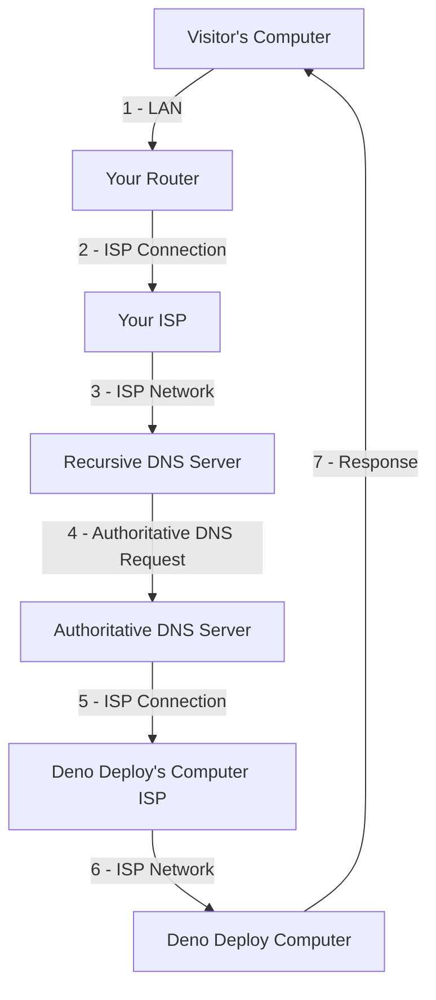

# How did we end up here?

#### How did I end up here
Well this page is just [a markdown file](/blog/Build_Your_Own_Website#dynamic-routing) on a computer controlled by [Deno Deploy](https://deno.com/deploy). I uploaded this file to Github and Deno Deploy [grabbed it and uploaded it](https://github.com/ali-layken/BurstUI/actions) to that computer.

#### How did You end up at this file :page_facing_up:?
When you clicked the link to visit this blog, your request traveled through several systems, just like my uploaded file, before reaching the computer hosting this post. Here's a breakdown of what happened:

## How do we get there?

## Delivering Requests
